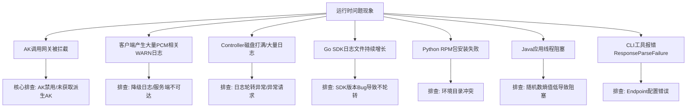
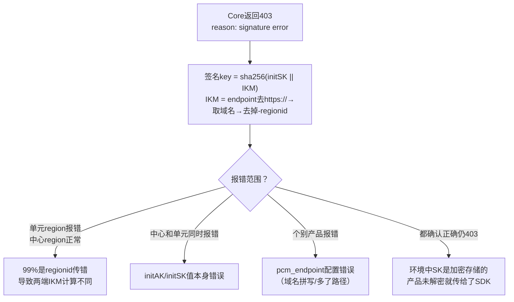

# 运维指导-运维手册

### 核心服务依赖
*依赖以下核心服务进行数据存储与管理：*
*   **UMM（AK 生命周期管理）**：负责 AK 的存储与生命周期管理，接收 Controller 指令执行凭证轮换和禁用操作。
*   **AAS（账户管理服务）**：负责平台账户统一管理，与 UMM 联动形成账户-凭证关联关系。

### 常用数据库与数据表
*   **服务名称**：`certificate-lifecycle-manager-server`
*   **数据库实例**：`clm_db`
*   **数据库名**：`pcm_db`
*   **常用表**：
    *   `ak_info`：存储派生 AK 信息。用于排查派生 AK 是否存在或被禁用（派生 AK 控制台仅可查最近 14 把，可通过此表查询全量）。
        *   查询示例：`select * from ak_info where access_key_id='****';`

### 相关源码与仓库
*   **PCM-core**：[https://code.alibaba-inc.com/aliyunas_sectech/pcm-core](https://code.alibaba-inc.com/aliyunas_sectech/pcm-core)
*   **PCM-controller**：[https://code.alibaba-inc.com/aliyunas_sectech/pcm-controller](https://code.alibaba-inc.com/aliyunas_sectech/pcm-controller)

## 关键日志与监控巡检

### 关键日志能力说明
*   **PCM Controller（策略中心）**：提供日志查询关联能力，可关联 AK 使用记录（平台 AK 访问日志），用于判断派生 AK 是否可以安全禁用。
*   **平台 AK 访问日志**：用于检查底表 AK 和派生 AK 在网关中是否有调用记录，作为队列轮转保护机制（保护三）的判断依据。

### 日志路径与轮转策略

| 组件 | 日志路径/位置 | 日志内容 | 轮转策略与注意事项 |
| --- | --- | --- | --- |
| PCM Controller | `/home/admin/pcm_controller/logs/api/logs/` | API 请求日志、异常请求、定时任务报错等 | 需确认日志轮转配置是否正常。若出现超大文件导致磁盘打满，需手动清理历史日志（保留最近日志），并排查是否有大量异常请求或定时任务循环报错。 |
| Go SDK | 应用本地日志文件 | SDK 运行日志 | **2512 之前版本存在日志轮转 Bug**，会导致文件持续增长。需升级至 2512 及以上版本。临时处理：使用 `> logfile` 截断日志文件（切勿 `rm` 正在写入的文件）。 |
| PCM Core (Nginx) | `access.log` | 访问日志，包含 `limit_req_status` 字段 | 用于排查 HTTP 502 限流问题。可通过 `tsar -l -i 1 --nginx` 查看 QPS。 |
| 客户端/Java SDK | 应用标准输出/日志文件 | `Failed to refresh credential` 等 WARN 日志，或线程阻塞堆栈 | 当 PCM 服务端未部署或不可达时，SDK 降级会产生大量 WARN 日志，不影响业务但可能触发监控告警。 |

### 巡检手册与潜在风险防范
1.  **限流配置巡检**：定期检查 Core 限流配置及 QPS 水位，防止单 IP 多组件导致的限流误伤。
2.  **时间敏感服务巡检**：接入 PCM 可能导致部分时间敏感服务延迟加大，需关注网络延迟，建议为时间敏感服务配置 1s 超时策略（通过 `PCM_TASK_DELAY` 环境变量）。
3.  **半轮转模式风险排查**：部分产品采用半自动轮转模式（仅在启动时获取一次派生 AK）。若首次获取失败（如 Core 限流、网络抖动），产品将持续使用底表 AK 或无有效凭据运行且不会自动恢复。需确保首次获取成功或改为持续轮转模式。
4.  **底表禁用联动风险排查**：底表 AK 被 PCM 禁用后，产品的凭据供给完全依赖 PCM 链路。若此时 PCM 不可用且本地无缓存，重启服务将拿不到任何有效凭据导致业务中断。需确保 PCM 链路高可用，或在禁用底表前确认所有节点已缓存有效派生 AK。
5.  **日志屏蔽风险排查**：部分产品因 Java WARN 日志过多而屏蔽了报错日志，导致无请求 PCM 的 requestid 等关键信息，增加排查难度。建议通过调整日志级别而非直接屏蔽来优化。

## 问题排查与运维操作 SOP

### 排查总览



### 高可用与容错异常排查
当出现凭证获取异常时，可参考以下 SDK 行为与业务影响进行排查：

| 异常场景 | SDK 行为 | 业务影响 | 排查与处理思路 |
| --- | --- | --- | --- |
| 新部署时 PCM Core 还未 ready | 将入参（底表AK）作为返回 | 无影响（Core 未禁用老 AK） | 检查 PCM Core 组件状态，等待其就绪。 |
| 运行时 PCM Core 挂了 | 返回上次获取的老凭证（未在窗口期末尾） | 无影响 | 检查 PCM Core 集群状态及 Pod 运行情况，恢复服务。 |
| 产品独立升级，PCM 未 ready | 将入参作为返回 | 无影响 | 确认 PCM 服务状态，确保升级顺序正确。 |
| PCM 和应用都挂了需重拉（SDK 缓存未丢失） | 返回上次获取的老凭证 | 无影响 | 优先恢复应用，SDK 会自动使用本地缓存（AES-256-GCM解密）。 |
| PCM 和应用都挂了需重拉（SDK 缓存丢失） | **需先恢复 PCM 或使用老凭证应急脚本** | **业务中断** | **紧急处理**：立即恢复 PCM 服务，或通过应急脚本注入老凭证恢复业务。 |

### 凭证获取降级与网关拦截排查
这是 PCM 接入后最核心的排查场景，产品调用网关时可能报 AK 被禁用/无效/不存在。

**1. 判定 AK 类型**
从网关日志取出被拦截的 AK ID，在控制台或 `pcm_db.ak_info` 表查询是底表 AK 还是派生 AK。

**2. 分支一：底表 AK 被拦截（SDK 降级）**
说明 SDK 未成功获取派生 AK，走了降级逻辑或未适配。
*   **恢复**：在 PCM 控制台启用该底表 AK，恢复业务。
*   **SDK 降级排查路径**：
    1.  **第一层（内存缓存）**：检查 SDK 内存缓存中凭据是否存在且未过期。
    2.  **第二层（Core 缓存）**：若内存未命中，检查 PCM Core 共享内存缓存（如 `initak_queue`、`endpoint_queue` 等）。
    3.  **第三层（本地文件）**：若请求 Core 失败（网络不通/超时/Core异常），检查 SDK 本地加密文件（AES-256-GCM 解密）是否有有效凭证。
    4.  **最终降级**：若以上均失败，SDK 将降级返回底表 AK（code=401），此时需重点排查 PCM Core 与 Controller 的网络连通性及服务健康度。

**3. 分支二：派生 AK 被拦截**
说明派生 AK 已被轮转禁用，产品未及时更新。
*   **恢复**：通常重启服务会刷新 AK 导致可用，然后停止该队列的轮转；若无法重启，需手动启用 AK（参考 PCM应急处置）。
*   **排查**：检查 SDK 是否仅获取一次未持续轮转，查看 SDK 报错日志。

**4. 客户端产生大量 PCM 相关 WARN 日志**
*   **现象**：产品日志中大量 `Failed to refresh credential, pcm server is xxx`。
*   **处理**：这类 WARN 日志**不影响业务**（SDK 已降级返回原始凭证），主要影响是客户端告警监控被触发。若因 2507 版本服务端未部署或 baseServiceAll 未升级导致，可忽略或升级版本。

### 派生 AK 队列轮转停止排查
若发现派生 AK 队列停止轮转，请排查以下保护机制是否被触发：
*   **保护一（最新派生 AK 保护）**：检查即将禁用的 AK 是否为某产品获取的“最新”派生 AK。若是，需等待该产品获取更新凭证后才会继续轮转。
*   **保护二（访问日志不可行）**：检查平台 AK 访问日志采集是否正常。若不可行，系统会在第一把队列即将禁用时停止轮转。
*   **保护三（访问日志保护）**：检查平台 AK 访问日志，确认即将禁用的派生 AK 是否仍有产品在调用。若有调用记录，轮转将暂停。

### 客户端与 SDK 异常排查

**1. Java 应用线程阻塞**
*   **现象**：线程 dump 中出现阻塞堆栈 `BLOCKED (on object monitor) at sun.security.provider.NativePRNG$RandomIO.implNextBytes`。
*   **原因**：SDK 默认使用 `/dev/random` 阻塞模式获取随机数，系统熵值低（< 100）时线程被卡住。
*   **处理**：升级 SDK 至 `credprovider.plugin >= 1.0.8`；临时规避加 JVM 参数 `-Djava.security.egd=file:/dev/./urandom`。

**2. CLI 工具报错 ResponseParseFailure**
*   **现象**：返回 `{"code": "ResponseParseFailure", "data": "", "message": "xxxxxxx"}`。
*   **原因**：`pcm_endpoint` 地址不对，该地址响应 200 但格式非预期，CLI 解析失败且未走降级。
*   **处理**：确认 CLI 的 `pcm_endpoint` 指向正确的 PCM Core 地址，手动 curl 确认返回格式。

**3. Python SDK RPM 包安装失败**
*   **现象**：安装 `pcm-python2-sdk-rpm-with-no-six` 报错 `cpio: File from package already exists as a directory`。
*   **原因**：系统已有 `/home/tops/lib/python2.7/site-packages/pytz/` 目录，与 RPM 包冲突。
*   **处理**：备份并移除冲突目录 `mv /home/tops/lib/python2.7/site-packages/pytz /home/tops/lib/python2.7/site-packages/pytz_bak`，然后重新 `yum install`。

### Core 错误码快速定位

#### HTTP 400 — 请求参数错误

| 返回 Msg | 报错原因 | 排查方向 |
| --- | --- | --- |
| `SecretName or x_acs_bearer_token is nil` | SecretName 或 token 为空 | SDK 侧 initakid 和 pcm_endpoint 是否正确 |
| `SecretName parse fail, SecretName:xxxx` | SecretName 格式错误 | appName 是否正确以 `:` 分隔 |
| `The access key (AK) is not administered by the PCM service, AK:xxxx` | akid 非底表 AK | initakid 是否填写正确的底表 akid |
| `genJwtKey fail` | 计算 token_key 失败 | Core 内部问题，与 SDK 无关 |
| `Error in AK rotation led to unsuccessful request to the controller...` | 请求 Controller 派生失败 | 1. 派生 AK 容量达上限<br>2. IAMID 非法且关闭了非标开关 |

#### HTTP 403 — 认证失败

| 返回 Msg | 报错原因 | 排查方向 |
| --- | --- | --- |
| `reason: signature error` | 签名验证失败 | 见下方 signature error 排查图 |
| `reason: "nbf" claim not valid until` | 时钟不同步 | 检查 SDK 所在机器 NTP 同步状态（3186-2605/320-2607 后已增加 5 分钟容错） |
| `token_arn not same with arn...` | ARN 不一致 | SDK 内部问题，基本不出现 |

**signature error 排查思路：**


*注：部分环境中底表 SK 是加密存储的，产品未解密就传给 SDK 会导致签名 key 两端不一致，必然 403。需确认产品侧调用 SDK 前已解密 SK。*

#### HTTP 502 — 限流触发
*   **排查步骤**：
    1.  检查 `access.log` 中 `limit_req_status` 字段。
    2.  `tsar -l -i 1 --nginx` 查看 QPS。
    3.  调整限流配置：`/services/platform-credential-management/user/pcm_conf/pcm_core.json`。
    4.  阈值参考（单核）：x86=200r/s, aarch64=189r/s, sw64=80r/s。
*   *注意：PCM Core 的限流策略基于客户端 IP。当同一台机器上运行多个产品组件，一个高频产品的请求可能耗尽该 IP 的限流配额，导致同 IP 下其他产品被连带返回 502。*

## 运维工具与黑屏操作

### 网关日志查询与底表 AK 使用情况排查
当需要排查特定事件ID对应的AK使用情况，或需要扫描网关日志中底表AK的调用记录时，可使用**网关日志查询工具**。工具需上传至OPS1服务运行（或可以解析slsinner的环境）。

**1. 工具配置**
将配置文件与CLI工具放在相同目录下，配置SLS访问凭证及Endpoint（需通过PCM控制台手动获取派生AK）：
```yaml
sls:
  credentials:
    sls:   # 对应SLS的派生AK                  
      access_key_id: "your_access_key_id" 
      access_key_secret: "your_access_key_secret" 
    defaultUser:  # 对应默认用户的派生ak           
      access_key_id: "your_access_key_id"  
      access_key_secret: "your_access_key_secret"
  inner_endpoint: "data.cn-wulan-env17e-d01.sls.inter.env17e.shuguang.com"
  pub_endpoint: "data.cn-wulan-env17e-d01.sls-pub.inter.env17e.shuguang.com"

scan:
  hours_back: 10       # 扫描周期（小时）
  page_size: 1000      
  max_workers: 20      
  auto_create_index: false  # 发现无索引时是否自动创建（true=自动创建，false=跳过）

output:
  path: "./output"
  format: "all"  # 可选: print, json, csv, all
```

**2. 排查与操作路径**
*   **根据事件ID查询使用AK**：用于排查特定网关和事件ID下的AK调用详情。
    ```bash
    ./main query --gateway <网关代码> --keyword "<事件ID或关键字>"
    # 示例：./main query --gateway OSS --keyword "tzRzgmefjFjXBC4C"
    ```
*   **遍历网关中底表AK调用记录**：用于全量扫描底表AK的使用情况，扫描记录将自动存储在相对路径的 `output/scan_result_{时间戳}.csv`。
    ```bash
    ./main scan
    ```

### 底表 AK 状态黑屏管理
当需要在黑屏环境下紧急启用/禁用指定AK、全量AK，或查询特定账号的AK时，可使用**底表AK黑屏操作工具**。

**1. 环境配置**
工具依赖PcmController服务，运行前需确保以下环境变量已正确配置：
*   `pcm_ctrl_domain`：PcmController服务的域名或IP。
*   `pcm_rs`：用于请求签名的密钥。

**2. 排查与操作路径**
*   **查询账号AK**：`python main.py query --account-id <账号ID>`
*   **启用/禁用指定AK**：
    ```bash
    python main.py enable --ak <AK_ID>   # 启用
    python main.py disable --ak <AK_ID>  # 禁用
    ```
*   **启用/禁用全量底表AK**（常用于紧急熔断或恢复场景）：
    ```bash
    python main.py enable-all   # 启用全部
    python main.py disable-all  # 禁用全部
    ```

## 版本升级指南与管控模式

### 版本升级与兼容策略

**1. 热升级兼容策略**
在进行版本升级或项目部署时，需根据场景选择正确的兼容策略：
*   **新部署项目**：根据 `restrict` 取值禁用原始通用能力，应用使用凭证进入定时轮换状态。
*   **热升级项目**：原始凭证**不禁用**其通用能力，进入定时轮换状态；如需禁用老凭证，需通过观测日志在运维控制台（PKM）灰度进行。
*   **非 PCM 托管凭证**：一切照旧；若使用了 PCM SDK/CLI 但未被托管，将入参 `initAK` 返回让应用接着使用。

**2. 具体组件版本升级要求**
*   **Go SDK**：升级至 **2512 及以上版本**（修复日志文件不轮转导致磁盘打满的 Bug）。
*   **Java SDK**：升级 `credprovider.plugin` 至 **>= 1.0.8**（修复 `/dev/random` 熵值低导致的线程阻塞问题）。
*   **CLI 工具**：升级至 **2025-12-23 之后更新版本**（修复服务端返回异常时不降级导致的 ResponseParseFailure 问题）。
*   **客户端版本**：升级至 **3186-2510 及以上版本**（解决 baseServiceAll 未升级导致的大量报错日志问题）。
*   **超时控制支持**：使用 **1.13-SNAPSHOT (20250908)** 及以上版本，支持 `PCM_TASK_DELAY` 环境变量设置访问 PCM 最大超时时间（默认 1000ms），适用于时间敏感服务。

### 管控模式切换指南
PCM 提供多种管控模式，运维时可根据改造进度进行调整：

| 模式 | 含义 | 行为 | 适用场景 | 版本要求 |
| --- | --- | --- | --- | --- |
| **None（默认）** | 不受 PCM 管理 | AK 正常使用，PCM 不介入 | 尚未改造的存量凭证 | / |
| **CompatibilityMode** | 部分完成改造 | 提供轮换能力，但不对旧 AK 禁用 | 改造中的过渡态 | v3182-2510 |
| **StrictMode** | 使用方改造完成 | 新部署严格托管；热升级/扩等场景自动降级为兼容模式 | 存量改造完成后的目标终态 | v3182-2515以后 |
| **initStrictMode** | 新建凭证即完成改造 | 任何场景都开启严格处理 | 新增收口凭证 | v320 |

> **运维注意**：模式从松到紧变更时**不自动生效**，需在 ASO 页面提示人工处理，防止误操作导致业务中断。