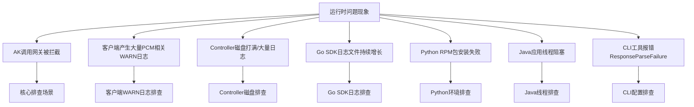
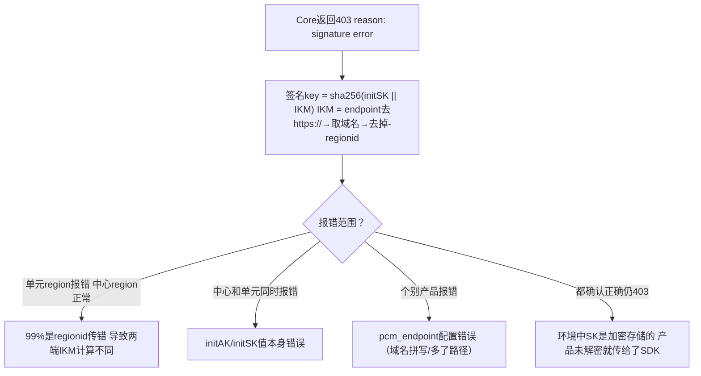

# 运维指导-运维手册

### UMMAK 数据库
- **服务与实例信息**：
  - service：`baseService-umm-ak`
  - db实例：`ummak`
  - 数据库：`ummak`
- **常用表**：
  - `accesskey_table`：存储 AK 的基础信息与状态（包括 `access_id`、`access_key`、`user_id`、`enabled_flag`、`hidden_flag`、`deleted_flag` 等字段）。

### PCM 数据库
- **服务与实例信息**：
  - service：`certificate-lifecycle-manager-server`
  - db实例：`clm_db`
  - 数据库：`pcm_db`
- **常用表**：
  - `init_ak_info`：存储 PCM 托管的底表 AK 信息（如 `umm_ak_status` 状态字段）。
  - `ak_info`：存储派生 AK 信息（如 `access_key_id` 等），用于查询派生 AK 是否存在及状态。

## 关键日志路径与轮转策略

### PCM Controller 日志
- **组件**：PCM Controller
- **日志路径**：`/home/admin/pcm_controller/logs/api/logs/`
- **内容与轮转策略**：记录 Controller 的 API 请求与处理日志。需确认日志轮转配置是否正常，若未正常轮转或存在大量异常请求/定时任务循环报错，会导致日志文件超大并打满磁盘。

### PCM Core (Nginx) 日志
- **组件**：PCM Core
- **日志路径**：`access.log`
- **内容与轮转策略**：记录 Core 层的访问日志，包含 `limit_req_status` 等限流状态字段，用于排查 502 限流问题。

### SDK 日志
- **Go SDK**：2512 之前版本存在日志轮转 Bug，会导致日志文件持续增长未按预期轮转。
- **Java SDK**：WARN 级别日志较多，部分产品可能会屏蔽报错日志，导致缺少请求 PCM 的 RequestId 等关键信息。

## 问题排查与应急处置 SOP

### 应急操作优先级原则
应急操作优先建议控制台白屏操作，当白屏无法访问时，采用在容器中执行脚本（调用服务接口），当容器无法访问时，直接在数据库中执行 SQL。
**优先级：控制台白屏 > 调用接口（容器脚本） > 数据库执行 SQL**

### 场景一：启用某个已经禁用的 initAK
**适用场景**：确认因为某把 initAK 被禁用而影响业务。

1. **白屏操作**：通过 PCM 控制台的 initAK 管理功能查询特定 AK，并在操作中启用该 AK。
2. **调用接口（容器中执行脚本）**：当白屏不可用时，采用此方案。在 PcmController 容器中使用底表AK黑屏操作工具执行启用命令：
   ```bash
   python3 manage_ak_status.py enable --ak {akid}
   ```
3. **数据库操作**：当白屏、容器均不可用时，采用此方案。
   - 进入 UMMAK 数据库（`ummak`）。
   - 执行 SQL 启用 AK：
     ```sql
     UPDATE accesskey_table SET enabled_flag=1 WHERE access_id = '{akid}';
     ```

### 场景二：启用全量底表 AK
**适用场景**：环境内存在被底表 AK 禁用而影响业务，涉及多把底表 AK 或无法确认某把底表 AK，可采用启用全量底表 AK。
> **注意**：暂不支持通过白屏解禁全量 AK。

1. **调用接口（容器中执行脚本）**：在 PcmController 容器中使用底表AK黑屏操作工具执行全量启用命令：
   ```bash
   python3 manage_ak_status.py enable-all
   ```
2. **数据库操作**：当容器不可访问时，采用此方案。
   - **步骤 1：获取全量底表 AK**
     - 进入 PCM 数据库（`clm_db` 实例的 `pcm_db` 数据库）。
     - 检索已经禁用的 initAK：
       ```sql
       USE pcm_db;
       SELECT access_key_id FROM init_ak_info WHERE umm_ak_status = 0;
       ```
   - **步骤 2：启用全量底表 AK**
     - 进入 UMMAK 数据库（`ummak` 实例的 `ummak` 数据库）。
     - 执行 SQL（将 `access_id` 字段参数改成步骤一中检索到的底表 AK 信息）：
       ```sql
       UPDATE accesskey_table SET enabled_flag=1 WHERE access_id IN ('akid1', 'akid2', 'akid3');
       ```

### 场景三：启用派生 AK
**适用场景**：确认某把派生 AK 被禁用影响业务。
> **注意事项**：每个派生队列中通过白屏仅可以查询最近 14 把派生 AK，如果超过 14 把 AK 后，会在 UMMAK 侧执行删除操作，但 PCM 数据库会保留派生 AK 记录。当通过白屏未查询到该 AK，有可能是 14 天前派生的 AK，可通过 PCM 数据库进行查询。

1. **白屏操作**：白屏支持查询派生 AK，查询后可通过启用操作恢复。
2. **数据库操作**：
   - **查询派生 AK**：进入 PCM 数据库（`clm_db` 实例的 `pcm_db` 数据库）进行查询。
     ```sql
     USE pcm_db;
     ```
   - **在 UMMAK 中启用**：进入 UMMAK 数据库（`ummak`）。
     - 如果 AK 存在，直接更新启用状态：
       ```sql
       UPDATE accesskey_table SET enabled_flag=1, hidden_flag=0, deleted_flag=0 WHERE access_id='{akid}';
       ```
     - 如果 AK 已经删除，重新创建 AK（需替换 `access_id`、`access_key`、`user_id`）：
       ```sql
       INSERT INTO `ummak`.`accesskey_table` (`access_id`, `access_key`, `user_id`) VALUES ('{akid}', '{sk}', '{uid}');
       ```

### 场景四：容量告警场景（AK 数量超限）
**适用场景**：UMMAK 侧每个 UID 下最大 1000 把有效 AK，当达到 1000 把以后会出现派生失败的情况。

1. **查询排查**：
   - 检查特定 UID 下的 AK 数量：
     ```sql
     SELECT user_id, COUNT(access_id) AS access_count FROM accesskey_table WHERE user_id = '{uid}' GROUP BY user_id;
     ```
   - 查询是否有 UID 下的 AK 超过 1000 把：
     ```sql
     SELECT user_id, COUNT(access_id) AS access_count FROM accesskey_table GROUP BY user_id HAVING access_count >= 1000;
     ```
2. **清理操作**：
   - 分析出环境内已经无用的 AK，在 UMMAK 中置成删除状态：
     ```sql
     UPDATE accesskey_table SET enabled_flag = 0, deleted_flag = 1, modified_time = UNIX_TIMESTAMP() WHERE access_id IN ('{akid1}', '{akid2}');
     ```

## 通用场景排查思路与常见问题

### 排查总览
以**问题现象**作为入口，引导排查思路：



### AK 调用网关被拦截
这是 PCM 接入后最核心的排查场景，产品调用网关时可能报 AK 被禁用/AK 无效/AK 不存在。首先需判断是否是 PCM 禁用 AK 导致。

**第一步：从网关日志中取出被拦截的 AK ID，在控制台查询是底表 AK 还是派生 AK。**
- **底表 AK 判定**：可以直接通过 PCM 控制台查询。
- **派生 AK 判定**：
  - 控制台仅可以查询每个队列最近 14 把派生 AK。
  - 数据库查询：进入 `clm_db` 实例的 `pcm_db` 数据库，执行 `select * from ak_info where access_key_id='****';` 检查是否存在。

#### 分支一：底表 AK 被拦截
**核心判断**：产品在使用底表 AK，说明 SDK 没有成功获取派生 AK，走了降级逻辑，或者使用底表 AK 未适配。排查方向是**为什么 SDK 没拿到派生 AK**。
1. **先恢复**：在 PCM 控制台启用该底表 AK，恢复业务。
2. **查 SDK 日志 code**：确认是哪种降级场景，参见下方“Core 错误码快速定位”。

#### 分支二：派生 AK 被拦截
**核心判断**：产品已经在使用派生 AK，但这把派生 AK 已被轮转禁用。排查方向是**为什么产品没有及时更新到最新的派生 AK**（最可能原因为：仅获取一次，未持续轮转）。
1. **恢复步骤**：通常重启服务会刷新 AK 导致可用，然后停止该队列的轮转。若无法重启服务，需手动启用 AK（参见应急处置 SOP）。
2. **排查步骤**：如果有 SDK 报错，参见下方“Core 错误码快速定位”。

### 客户端产生大量 PCM 相关 WARN 日志
- **现象**：产品日志中大量 `Failed to refresh credential, pcm server is xxx`。2507 版本 PCM 服务端尚未部署，或部分产品升级至 3186-2510 及以上版本但 baseServiceAll 未升级时，均可能出现。
- **关键判断**：这类 WARN 日志**不影响业务**（SDK 已降级返回原始凭证），主要影响是客户端告警监控被触发，如果调用非常频繁可能产生大量错误日志。

### PCM Controller 磁盘打满 / 产生大量日志
- **现象**：Controller 日志目录 `/home/admin/pcm_controller/logs/api/logs/` 下出现超大文件，磁盘空间不足。
- **处理方式**：
  1. 确认磁盘使用情况：`df -h`
  2. 查看日志目录大小：`du -sh /home/admin/pcm_controller/logs/api/logs/`
  3. 清理历史日志文件（保留最近日志）。
  4. 排查产生大量日志的原因：是否有大量异常请求持续打到 Controller，或是否有定时任务异常导致循环报错。
  5. 确认日志轮转配置是否正常。

### SDK 与 CLI 工具常见问题

#### Go SDK 日志文件持续增长
- **现象**：Go SDK 产生的日志文件不断增大，未按预期轮转。
- **原因**：Go SDK 在 2512 之前版本存在日志轮转 Bug。
- **解决方案**：升级 Go SDK 至 2512 及以上版本。临时处理可使用 `> logfile` 截断日志文件（不要 rm 正在写入的文件）。

#### Python SDK RPM 包安装失败
- **现象**：安装 `pcm-python2-sdk-rpm-with-no-six` 报错，关键字包含 `pytz/zoneinfo`、`cpio: File from package already exists as a directory`。
- **原因**：系统已有 `/home/tops/lib/python2.7/site-packages/pytz/` 目录，与 RPM 包冲突。
- **解决方式**：
  ```bash
  mv /home/tops/lib/python2.7/site-packages/pytz /home/tops/lib/python2.7/site-packages/pytz_bak
  sudo yum install pcm-python2-sdk-rpm-with-no-six -y
  ```

#### Java 应用线程阻塞
- **现象**：线程 dump 中出现阻塞堆栈 `java.lang.Thread.State: BLOCKED (on object monitor) at sun.security.provider.NativePRNG$RandomIO.implNextBytes...`。
- **原因**：SDK 默认使用 `/dev/random` 阻塞模式获取随机数，系统熵值低（< 100）时线程被卡住。
- **解决方案**：升级 SDK 至 `credprovider.plugin >= 1.0.8`。临时规避可添加 JVM 参数 `-Djava.security.egd=file:/dev/./urandom`。

#### CLI 工具报错 ResponseParseFailure
- **现象**：返回 `{"code": "ResponseParseFailure", "data": "", "message": "xxxxxxx"}`。
- **原因**：`pcm_endpoint` 地址不对，该地址响应 200 但格式非预期，CLI 解析失败且未走降级。
- **排查**：确认 CLI 的 `pcm_endpoint` 指向正确的 PCM Core 地址，手动 curl 确认返回格式（后续版本已优化解析异常的降级处理）。

### Core 错误码快速定位

#### HTTP 400 — 请求参数错误
| 返回 Msg | 报错原因 | 排查方向 |
| --- | --- | --- |
| `SecretName or x_acs_bearer_token is nil` | SecretName 或 token 为空 | SDK 侧 initakid 和 pcm_endpoint 是否正确 |
| `SecretName parse fail, SecretName:xxxx` | SecretName 格式错误 | appName 是否正确以 `:` 分隔 |
| `The access key (AK) is not administered by the PCM service, AK:xxxx` | akid 非底表 AK | initakid 是否填写正确的底表 akid |
| `genJwtKey fail` | 计算 token_key 失败 | Core 内部问题，与 SDK 无关 |
| `Error in AK rotation led to unsuccessful request to the controller...` | 请求 Controller 派生失败 | 1. 派生 AK 容量达上限<br>2. IAMID 非法且关闭了非标开关 |

#### HTTP 403 — 认证失败
| 返回 Msg | 报错原因 | 排查方向 |
| --- | --- | --- |
| `reason: signature error` | 签名验证失败 | 见下方 signature error 排查 |
| `reason: "nbf" claim not valid until` | 时钟不同步 | 见下方 nbf 时钟偏差 |
| `token_arn not same with arn...` | ARN 不一致 | SDK 内部问题，基本不出现 |

**signature error 排查思路**：


**nbf 时钟偏差**：
- SDK 生成 JWT 的 `nbf` 使用客户端 `time.Now()`。
- 版本 3186-2605 / 320-2607 后已增加 5 分钟容错。
- 仍出现则检查 SDK 所在机器 NTP 同步状态。

**SK 加密未解密导致 403**：
部分环境中底表 SK 是加密存储的。产品未解密就传给 SDK → 签名 key 两端不一致 → 必然 403。需确认产品侧调用 SDK 前已解密 SK。

#### HTTP 502 — 限流触发
PCM Core 的限流策略基于客户端 IP。当同一台机器上运行多个产品组件，一个高频产品的请求可能耗尽该 IP 的限流配额，导致同 IP 下其他产品被连带返回 502（存在误伤可能）。
- **限流排查**：
  1. 检查 access.log 中 `limit_req_status` 字段。
  2. 使用 `tsar -l -i 1 --nginx` 查看 QPS。
  3. 调整限流配置：`/services/platform-credential-management/user/pcm_conf/pcm_core.json`。
  4. 阈值参考（单核）：x86=200r/s, aarch64=189r/s, sw64=80r/s。

## 运维工具使用指南

### 网关日志查询工具

#### 基本介绍
- 支持通过网关+事件ID，查询日志详细信息。
- 支持在网关日志中扫描底表AK使用情况。

#### 运行环境与配置
- **运行位置**：上传到 OPS1 服务运行（或可以解析 slsinner 的环境）。
- **配置文件**：默认与 CLI 工具放在相同文件下即可。配置示例如下：
  ```yaml
  # 服务端简化配置
  sls:
    # 访问凭证（此处未自动适配pcm轮转，直接填 PCM 轮转后的 AK，通过pcm控制台手动获取派生AK）
    credentials:
      sls:   #test1000000004@aliyun.com 对应的派生AK                  
        access_key_id: "RONVzQyJJR2kRoLP" 
        access_key_secret: "hvZ8oi0vWJXjWERK9VVe3j3qm2IYwK" 
      defaultUser:  #aliyuntest 对应的派生ak           
        access_key_id: "beF7AyHhnIjY3eGy"  
        access_key_secret: "2R838QLvk0wjkGxL9mTPMlL1xWFX4q"

    # Endpoint 配置
    inner_endpoint: "data.cn-wulan-env17e-d01.sls.inter.env17e.shuguang.com"        # slsinner
    pub_endpoint: "data.cn-wulan-env17e-d01.sls-pub.inter.env17e.shuguang.com"      # slspub

  scan:
    hours_back: 10       # 扫描周期
    page_size: 1000      # 默认 可不修改
    max_workers: 20      # 默认 可不修改 
    auto_create_index: false  # 发现无索引时是否自动创建（true=自动创建，false=跳过）

  output:
    path: "./output"
    format: "all"  # 可选: print, json, csv, all
  ```

#### 使用指南
工具支持 `scan`（全量扫描）和 `query`（关键字查询）两种运行模式。

- **根据事件ID查询使用AK**
  ```bash
  ./main query --gateway OSS --keyword "tzRzgmefjFjXBC4C"
  ```

- **遍历网关中底表AK调用记录**
  ```bash
  ./main scan
  ```
  扫描记录将自动存储在相对路径的 `output/scan_result_{时间戳}.csv`。

### 底表AK黑屏操作工具

#### 基本介绍
- 支持启用/禁用指定AK。
- 支持启用/禁用全量AK。

#### 运行环境与配置
- **运行位置**：PcmController 容器。
  - 路径：`Product: baseServiceAll` → `sn: platform-credential-management` → `sr：PcmController#`，进入任意一台容器操作即可。
- **环境变量依赖**：工具依赖通过 PcmController 服务注册变量或环境中的 env 获取 `pcm_ctrl_domain` 和 `pcm_rs`。

#### 使用指南
在容器内执行 Python 脚本 `manage_ak_status.py`，支持以下操作：

- **启用单个 AK**
  ```bash
  python3 manage_ak_status.py enable --ak LTAI5txxxxxx
  ```
- **禁用单个 AK**
  ```bash
  python3 manage_ak_status.py disable --ak LTAI5txxxxxx
  ```
- **启用全部底表 AK**
  ```bash
  python3 manage_ak_status.py enable-all
  ```
- **禁用全部底表 AK**
  ```bash
  python3 manage_ak_status.py disable-all
  ```
- **查询指定账号的 AK**
  ```bash
  python3 manage_ak_status.py query --account-id {accountId}
  ```

## 潜在风险与已知问题

### 潜在风险清单

1. **链路增加延迟，对时间敏感业务有影响**
   - 接入 PCM 后可导致部分时间敏感服务延迟加大，且网络可能出现延迟。对于时间敏感服务，增加了 1s 超时策略。
   - 支持 `PCM_TASK_DELAY` 环境变量，用于设置访问 PCM 最大超时时间（单位 ms，默认 1000ms 即 1s）。
2. **无服务端时 SDK 频繁调用产生大量日志**
   - 当环境中 PCM 服务（Core）未部署或不可达时，SDK 无法生成缓存，仍会按配置的间隔持续尝试连接，每次失败产生 WARN 级别日志。
3. **部分 SDK 未打印关键日志，排查困难**
   - Java WARN 过多，部分产品屏蔽了报错日志，无请求 PCM 的 RequestId 等信息，增加排查难度。
4. **半轮转模式首次获取失败导致后续持续异常**
   - 部分产品采用半自动轮转模式（仅在启动时获取一次派生 AK，后续不再主动刷新）。如果该唯一一次获取请求恰好失败（Core 限流、网络抖动、服务未就绪），产品将持续使用底表 AK 或无有效凭据运行，且不会自动恢复。
5. **底表禁用后 PCM 可用性和禁用状态联动**
   - 底表 AK 被 PCM 禁用后，产品的凭据供给完全依赖 PCM 链路（Core + Controller）。对于本地有缓存的运行中服务暂时无影响，但重启的服务如果此时 PCM 不可用，将拿不到任何有效凭据（底表已禁、派生获取失败、本地无缓存），导致业务直接中断。

### 已知问题与修复版本

| 问题 | 修复版本 | 风险说明 |
| --- | --- | --- |
| CLI 服务端返回异常不降级（ResponseParseFailure） | 2025-12-23 更新版本 | CLI 直接不可用 |
| Java SDK 线程阻塞（/dev/random 熵值问题） | credprovider.plugin >= 1.0.8 | 应用线程卡死 |
| Go SDK 日志文件不轮转 | SDK >= 2512 版本 | 磁盘打满 |
| SDK 超时日志毫秒数为 null | 已知日志格式问题 | 未设置 `PCM_TASK_DELAY` 时默认 1s 超时，日志字段显示 null，不影响功能 |