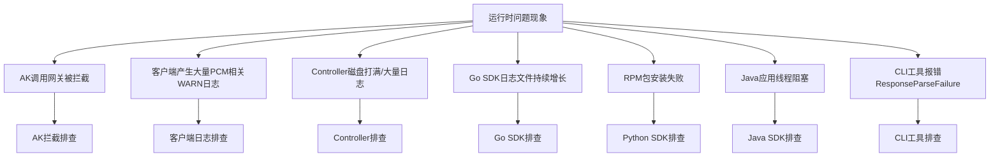
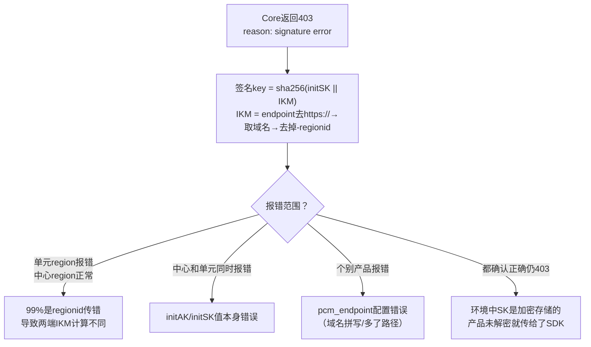

# 运维指导-运维手册

*   **服务**：certificate-lifecycle-manager-server
*   **DB 实例**：clm_db
*   **数据库**：pcm_db
*   **常用表**：
    *   `ak_info`：存储派生 AK 信息，用于检查派生 AK 是否存在及状态。
        *   查询示例：进入 `clm_db` 实例并切换到 `pcm_db` 后，执行 `select * from ak_info where access_key_id='****';`

## 关键日志与配置路径

### PCM 组件与 SDK

#### PCM Controller
*   **日志路径**：`/home/admin/pcm_controller/logs/api/logs/`
*   **轮转策略与问题**：需确认日志轮转配置是否正常。若出现超大文件导致磁盘空间不足，需排查是否有大量异常请求持续打到 Controller 或定时任务异常导致循环报错，并清理历史日志文件（保留最近日志）。
*   **EOCC 参考**：https://eocc.aliyun-inc.com/kbscene/emergencyDetail/EC9EE9AE20?Jump=2

#### PCM Core
*   **访问日志**：`access.log`（排查限流时需检查 `limit_req_status` 字段）
*   **限流配置文件**：`/services/platform-credential-management/user/pcm_conf/pcm_core.json`

#### Go SDK
*   **轮转策略与问题**：2512 之前版本存在日志轮转 Bug，导致日志文件持续增长未按预期轮转。需升级版本，或临时使用 `> logfile` 截断日志文件（切勿 `rm` 正在写入的文件）。

## 网关拦截日志路径与特征

当遇到访问报错，怀疑是 [[PCM/PCM/index|PCM]] 禁用 AK 导致时，可通过以下各网关的拦截日志进行判定与提取 AK。

### OSS 网关
*   **组件/SR**：`oss_tengine`
*   **关键日志路径**：`/apsara/module_logs/oss_tengine/access_log.*`
*   **拦截特征**：
    *   `"error_code": "InvalidAccessKeyId"`
    *   `"status": "403"`
*   **日志示例**：
```json
{
  "__tag__:__hostname__": "c25g07018.cloud.g07.amtest17",
  "__tag__:__path__": "/apsara/module_logs/oss_tengine/access_log.2026042415",
  "access_id": "5hN1RkUhRn43iNfw",
  "bucketname": "cn-wulan-env17e-d01-as-console-cdn",
  "error_code": "InvalidAccessKeyId",
  "host": "cn-wulan-env17e-d01-as-console-cdn.oss-cn-wulan-env17e-d01-a.intra.env17e.shuguang.com",
  "ip": "10.17.46.36",
  "method": "GET",
  "operation": "GetBucketAcl",
  "request_id": "69EB1A0A3E6DA93539F3A4CE",
  "status": "403",
  "time": "24/Apr/2026:15:21:46",
  "url": "/?acl"
}
```

### SLS 网关

#### SLS_INNER
*   **组件/SR**：`fcgi_agent` (ols)
*   **关键日志路径**：`/apsara/fcgi_agent/ols_operation_2.LOG`
*   **拦截特征**：`"Status": "401"`
*   **日志示例**：
```json
{
  "APIVersion": "0.6.0",
  "AccessKeyId": "cmchJQg057pBelHD",
  "ClientIP": "10.17.160.103",
  "ConsumerGroup": "suspicous_group",
  "LogStore": "big_data_event",
  "Method": "GetConsumerGroupCheckPoint",
  "ProjectName": "k8sblink",
  "RequestId": "69EB0C444B76F491098A2F35",
  "Status": "401",
  "__tag__:__hostname__": "c25h05123.cloud.h06.amtest17",
  "__tag__:__path__": "/apsara/fcgi_agent/ols_operation_2.LOG"
}
```

#### SLSPUB
*   **组件/SR**：`fcgi_agent` (sls)
*   **关键日志路径**：`/apsara/sls/fcgi_agent/ols_operation.LOG`
*   **拦截特征**：
    *   `"Status": "401"`
    *   `"ErrorCode": "Unauthorized"`
    *   `"ErrorMsg": "AccessKeyId is disabled: <AK>"`
*   **日志示例**：
```json
{
  "AccessKeyId": "Khz7a1kmKMZDCBXj",
  "ClientIP": "10.17.31.30",
  "ErrorCode": "Unauthorized",
  "ErrorMsg": "AccessKeyId is disabled: Khz7a1kmKMZDCBXj",
  "LogStore": "sls_operation_agg_log",
  "Method": "ListShards",
  "ProjectName": "ali-cdsslshybridcluster-a-20260323-015f-sls-admin",
  "RequestId": "69D6169B34510383396636E7",
  "Status": "401",
  "__tag__:__hostname__": "c25g09017.cloud.g09.amtest17",
  "__tag__:__path__": "/apsara/sls/fcgi_agent/ols_operation.LOG"
}
```

### ASAPI 网关
*   **组件/SR**：`asapi.ApiServer#`
*   **关键日志路径**：`/apsara/cloud/data/asapi/ApiServer#/api-server/logs/asapi-logger/audit.log`
*   **拦截特征**：
    *   `"errorCode": "asapi.server.request.parameter.accesskeyid.error"`
    *   `"errorMessage": "The specified AccessKey ID (<AK>) is invalid. Details: (The Access Key is disabled.)."`
*   **日志示例**：
```json
{
  "EagleeyeTraceId": "0a11243f17770122001463084d0062",
  "__tag__:__hostname__": "vm010017036063",
  "__tag__:__path__": "/apsara/cloud/data/asapi/ApiServer#/api-server/logs/asapi-logger/audit.log",
  "accessKeyId": "VidKjhddRaas4tMA",
  "apiName": "ListAllLevel1Orgs",
  "callerIp": "10.17.32.38",
  "errorCode": "asapi.server.request.parameter.accesskeyid.error",
  "errorMessage": "The specified AccessKey ID (VidKjhddRaas4tMA) is invalid. Details: (The Access Key is disabled.).",
  "errorSuggestion": "Check whether the AccessKey pair exists and is enabled.",
  "errorTitle": "The AccessKey pair in the request is invalid.",
  "httpMethod": "POST",
  "productName": "ascm",
  "requestId": "0a11243f17770122001463084d0062",
  "serverRole": "asapi.ApiServer#",
  "status": "failed"
}
```

### KMS 网关
*   **组件/SR**：`kms.KmsHost#`
*   **关键日志路径**：`/cloud/log/kms/KmsHost#/kms_host/audit.log`
*   **拦截特征**：
    *   `"error_code": "Forbidden.AccessKey"`
    *   `"error_message": "This AccessKey is not enabled."`
    *   `"status_code": "403"`
*   **日志示例**：
```json
{
  "URL": "ListKeys",
  "__tag__:__hostname__": "c25h09107.cloud.h10.amtest17",
  "__tag__:__path__": "/cloud/log/kms/KmsHost#/kms_host/audit.log",
  "accesskeyid": "bpzC7chEgkHAFlsn",
  "api_name": "ListKeys",
  "cluster": "KmsCluster-A-20260323-018b",
  "error_code": "Forbidden.AccessKey",
  "error_message": "This AccessKey is not enabled.",
  "expected_code": "403",
  "failed_status_code": "4XX",
  "ip": "10.17.4.31",
  "region_id": "cn-wulan-env17e-d01",
  "request_id": "0efdb6f6-ae55-445e-b1e9-f514351d287b",
  "serverrole": "kms.KmsHost#",
  "status_code": "403"
}
```

### ODPS 网关
*   **组件/SR**：`odps-service-frontend` (FrontendServer#)
*   **关键日志路径**：`/cloud/log/odps-service-frontend/FrontendServer#/frontend_server/tengine/logs/aggregated_log.log`
*   **日志示例**：
```json
{
  "__tag__:__hostname__": "vm010017037223",
  "__tag__:__path__": "/cloud/log/odps-service-frontend/FrontendServer#/frontend_server/tengine/logs/aggregated_log.log",
  "execution_end_time": "2026-04-24T06:37:03.348203",
  "execution_start_time": "2026-04-24T06:37:01.586769",
  "metadata": {
    "access_id": "fXWvhmRkMeER5QI6",
    "network_client_ip": "10.17.37.83",
    "vpc_id": "0"
  },
  "requests": {
    "url": [
      "/api/logview/host?curr_project=admin_task_project",
      "/api/projects?expectmarker=true&curr_project=admin_task_project"
    ]
  }
}
```

## 问题排查SOP与通用场景

### 排查总览

以**问题现象**作为入口，引导排查思路：



### 场景一：AK 调用网关被拦截

这是 PCM 接入后最核心的排查场景，产品调用网关时可能报 AK 被禁用/AK 无效/AK 不存在。首先需判断是否是 PCM 禁用 AK 导致。

#### 通用排查与处置思路
1. **日志判定**：优先通过各网关的拦截日志（参见上文“网关拦截日志路径与特征”）进行判定。
2. **提取 AK**：从拦截日志中提取请求所使用的 AccessKey (AK)。
3. **状态查询**：通过 PCM 控制台或数据库查询该 AK 的当前状态，并判断是底表 AK 还是派生 AK。
4. **应急处置**：如果确认该 AK 已经被禁用，立即采用应急处置方案（如恢复 AK 或切换 AK）。
5. **原因排查**：根据 AK 类型进入下方详细分支排查，或将问题反馈至研发侧排查根本原因。

#### AK 类型判定
*   **底表 AK 判定**：可以直接通过控制台查询。
*   **派生 AK 判定**：
    *   控制台仅可以查询每个队列最近 14 把派生 AK。
    *   数据库查询：参见上文“基础服务与数据库信息”中的 `ak_info` 表查询。

#### 分支一：底表 AK 被拦截
*   **核心判断**：产品在使用底表 AK，说明 SDK 没有成功获取派生 AK，走了降级逻辑（或使用底表 AK 未适配）。排查方向是**为什么 SDK 没拿到派生 AK**。
*   **排查步骤**：
    1.  **先恢复**：在 PCM 控制台启用该底表 AK，恢复业务。
    2.  **查 SDK 日志 code**：确认是哪种降级场景，参见下文“Core 错误码快速定位”。

#### 分支二：派生 AK 被拦截
*   **核心判断**：产品已经在使用派生 AK，但这把派生 AK 已被轮转禁用。排查方向是**为什么产品没有及时更新到最新的派生 AK**（最可能原因为：仅获取一次，未持续轮转）。
*   **恢复步骤**：
    1.  通常重启服务会刷新 AK 导致可用，然后停止该队列的轮转。
    2.  若无法重启服务，需要手动启用 AK。参见 PCM 应急处置。
*   **排查步骤**：如果有 SDK 报错，参见下文“Core 错误码快速定位”。

### 场景二：Core 错误码与 HTTP 状态码排查

当排查过程中从 SDK 报错信息中拿到了具体错误码，按以下表格辅助定位：

#### HTTP 400 — 请求参数错误

| 返回 Msg | 报错原因 | 排查方向 |
| --- | --- | --- |
| `SecretName or x_acs_bearer_token is nil` | SecretName 或 token 为空 | SDK 侧 initakid 和 pcm_endpoint 是否正确 |
| `SecretName parse fail, SecretName:xxxx` | SecretName 格式错误 | appName 是否正确以 `:` 分隔 |
| `The access key (AK) is not administered by the PCM service, AK:xxxx` | akid 非底表 AK | initakid 是否填写正确的底表 akid |
| `genJwtKey fail` | 计算 token_key 失败 | Core 内部问题，与 SDK 无关 |
| `Error in AK rotation led to unsuccessful request to the controller...` | 请求 Controller 派生失败 | 1. 派生 AK 容量达上限<br>2. IAMID 非法且关闭了非标开关 |

#### HTTP 403 — 认证失败

| 返回 Msg | 报错原因 | 排查方向 |
| --- | --- | --- |
| `reason: signature error` | 签名验证失败 | 见下方 signature error 排查 |
| `reason: "nbf" claim not valid until` | 时钟不同步 | 见下方 nbf 时钟偏差 |
| `token_arn not same with arn...` | ARN 不一致 | SDK 内部问题，基本不出现 |

**signature error 排查思路**：



**nbf 时钟偏差**：
*   SDK 生成 JWT 的 `nbf` 使用客户端 `time.Now()`。
*   版本 3186-2605 / 320-2607 后已增加 5 分钟容错。
*   若仍出现，则检查 SDK 所在机器 NTP 同步状态。

**SK 加密未解密导致 403**：
部分环境中底表 SK 是加密存储的。产品未解密就传给 SDK → 签名 key 两端不一致 → 必然 403。需确认产品侧调用 SDK 前已解密 SK。

#### HTTP 502 与限流排查
*   **现象**：大概率触发限流。PCM Core 的限流策略基于客户端 IP。当同一台机器上运行多个产品组件，一个高频产品的请求可能耗尽该 IP 的限流配额，导致同 IP 下其他产品被连带返回 502（存在误伤可能）。
*   **排查步骤**：
    1.  检查 `access.log` 中 `limit_req_status` 字段。
    2.  使用 `tsar -l -i 1 --nginx` 查看 QPS。
    3.  调整限流配置：`/services/platform-credential-management/user/pcm_conf/pcm_core.json`。
    4.  阈值参考（单核）：x86=200r/s, aarch64=189r/s, sw64=80r/s。

### 场景三：客户端与组件异常日志排查

*   **客户端产生大量 PCM 相关 WARN 日志**
    *   **现象**：产品日志中大量 `Failed to refresh credential, pcm server is xxx`。
    *   **判断与处理**：这类 WARN 日志**不影响业务**（SDK 已降级返回原始凭证），主要影响是客户端告警监控被触发。2507 版本 PCM 服务端尚未部署或部分产品升级至 3186-2510 及以上版本但 baseServiceAll 未升级时，可能因降级返回原始底表 AK 而产生大量错误日志。
*   **SDK 超时日志毫秒数为 null**
    *   **现象**：未设置 `PCM_TASK_DELAY` 时默认 1s 超时，日志字段显示 null。
    *   **判断与处理**：已知日志格式问题，不影响功能。

### 场景四：其他常见安装与运行问题

*   **Java 应用线程阻塞**
    *   **现象**：线程 dump 中出现阻塞堆栈 `java.lang.Thread.State: BLOCKED (on object monitor) at sun.security.provider.NativePRNG$RandomIO.implNextBytes...`
    *   **原因**：SDK 默认使用 `/dev/random` 阻塞模式获取随机数，系统熵值低（< 100）时线程被卡住。
    *   **解决方案**：升级 SDK 至 `credprovider.plugin >= 1.0.8`；临时规避可添加 JVM 参数 `-Djava.security.egd=file:/dev/./urandom`。
*   **CLI 工具报错 ResponseParseFailure**
    *   **现象**：返回 `{"code": "ResponseParseFailure", "data": "", "message": "xxxxxxx"}`。
    *   **原因**：`pcm_endpoint` 地址不对，该地址响应 200 但格式非预期，CLI 解析失败且未走降级。
    *   **排查**：确认 CLI 的 `pcm_endpoint` 指向正确的 PCM Core 地址，手动 curl 确认返回格式（后续版本已优化解析异常的降级处理）。
*   **Python SDK RPM 包安装失败**
    *   **现象**：安装 `pcm-python2-sdk-rpm-with-no-six` 报错，关键字 `pytz/zoneinfo`、`cpio: File from package already exists as a directory`。
    *   **原因**：系统已有 `/home/tops/lib/python2.7/site-packages/pytz/` 目录，与 RPM 包冲突。
    *   **解决方式**：
        ```bash
        mv /home/tops/lib/python2.7/site-packages/pytz /home/tops/lib/python2.7/site-packages/pytz_bak
        sudo yum install pcm-python2-sdk-rpm-with-no-six -y
        ```

## 版本升级指南

| 组件/SDK | 推荐版本 | 升级目的/修复问题 |
| --- | --- | --- |
| **Go SDK** | >= 2512 版本 | 修复日志文件不轮转导致磁盘打满的问题 |
| **Java SDK** | credprovider.plugin >= 1.0.8 | 修复 `/dev/random` 熵值问题导致的应用线程阻塞 |
| **CLI 工具** | 2025-12-23 及以后更新版本 | 修复服务端返回异常不降级（ResponseParseFailure）导致 CLI 直接不可用的问题 |
| **时间敏感服务 SDK** | 1.13-SNAPSHOT (20250908) 及以上 | 支持 `PCM_TASK_DELAY` 环境变量，用于设置访问 PCM 最大超时时间（默认 1000ms），缓解接入 PCM 后导致的时间敏感服务延迟加大问题 |

## 潜在风险与巡检关注点

在日常巡检和运维中，需重点关注以下潜在风险：

1.  **链路增加延迟**：接入 PCM 后可能导致部分时间敏感服务延迟加大，且网络可能出现延迟。
2.  **无服务端时 SDK 频繁调用产生大量日志**：当环境中 PCM 服务（Core）未部署或不可达时，SDK 无法生成缓存，仍会按配置的间隔持续尝试连接，每次失败产生 WARN 级别日志。
3.  **部分 SDK 未打印关键日志**：Java WARN 过多，部分产品屏蔽了报错日志，无请求 PCM 的 requestid 等信息，增加排查难度。
4.  **半轮转模式首次获取失败导致后续持续异常**：部分产品采用半自动轮转模式（仅在启动时获取一次派生 AK，后续不再主动刷新）。如果该唯一一次获取请求恰好失败（Core 限流、网络抖动、服务未就绪），产品将持续使用底表 AK 或无有效凭据运行，且不会自动恢复。
5.  **底表禁用后 PCM 可用性和禁用状态联动**：底表 AK 被 PCM 禁用后，产品的凭据供给完全依赖 PCM 链路（Core + Controller）。对于本地有缓存的运行中服务暂时无影响，但重启的服务如果此时 PCM 不可用，将拿不到任何有效凭据（底表已禁、派生获取失败、本地无缓存），导致业务直接中断。
6.  **存量旧版本风险**：环境中可能存在未升级的旧版本 SDK/CLI，需定期巡检并推动升级以规避上述已知问题。