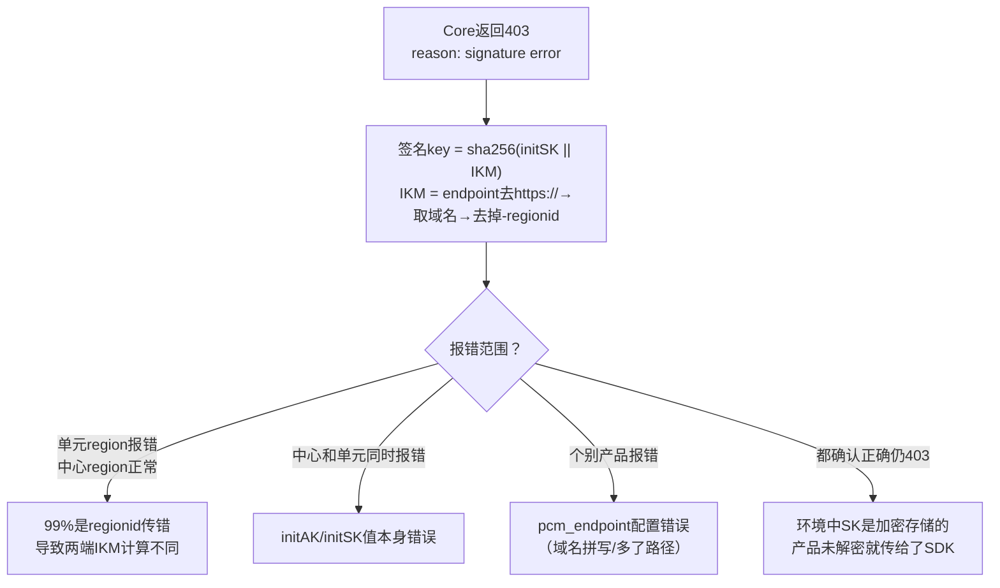

# 运维指导-运维手册

*   **所属产品**：`baseServiceAll`
*   **部署集群**：`StandardCloudCluster-A-xx`
*   **所属 Service**：`platform-credential-management`
*   **核心组件**：`PCM Core`、`PCM Controller`
*   **服务名称**：`certificate-lifecycle-manager-server`


## 常用数据库与数据表

### UMMAK 数据库
*   **所属服务**：`baseService-umm-ak`
*   **DB 实例**：`ummak`
*   **数据库名**：`ummak`
*   **常用表**：
    *   `accesskey_table`：存储 AK（Access Key）的核心信息，包括 `access_id`（AK ID）、`access_key`（SK）、`user_id`（账号 UID），以及状态字段如 `enabled_flag`（启用状态）、`hidden_flag`（隐藏状态）、`deleted_flag`（删除状态）等。

### PCM 数据库
*   **所属服务**：`certificate-lifecycle-manager-server`
*   **DB 实例**：`clm_db`
*   **数据库名**：`pcm_db`
*   **常用表**：
    *   `init_ak_info`：存储 PCM 托管的底表 AK 信息，包含 `access_key_id` 以及 `umm_ak_status`（UMMAK 侧的 AK 状态）等字段。
    *   `ak_info`：存储派生 AK 信息，用于检查派生 AK 是否存在及状态。
        *   **查询示例**：进入 `clm_db` 实例并切换到 `pcm_db` 后，执行 `select * from ak_info where access_key_id='****';`

## 日常运维与控制台操作

### PCM 控制台
*   **访问路径**：ASO —> 安全管理 —> 账户安全 —> 平台凭据管理PCM


### 底表 AK 管理
1.  可查询底表 AK 禁用状态。
2.  启用底表 AK。

> **注意**：未提供白屏底表 AK 禁用能力，底表 AK 禁用请详见变更文档或使用黑屏工具。


### 派生 AK 管理

#### 派生 AK 状态查询与申请详情
**适用场景**：用于查看派生 AK 申请记录及状态。
*   **认证状态失败**：仅表示 IAMID 不规范，但不会对申请结果有任何影响。
*   **轮转状态已停止**：可能由以下原因导致：
    1.  IAMID 中有 `CLOSE_AUTO_ROTATE` 状态，表示该队列默认不轮转。
    2.  使用该产品的队列，有产品未及时更新（参考：[《[[PCM/平台凭证管理服务/index|平台凭证管理服务]]（PCM）介绍》](https://alidocs.dingtalk.com/i/nodes/r1R7q3QmWew5lo02fZRn00oKJxkXOEP2?utm_scene=team_space&iframeQuery=anchorId%3Duu_mo8et3bkdnbpoxrkv3)）。
    3.  使用该队列的产品中，有产品仍在第7把 AK（参考：[《平台凭证管理服务（PCM）介绍》](https://alidocs.dingtalk.com/i/nodes/r1R7q3QmWew5lo02fZRn00oKJxkXOEP2?utm_scene=team_space&iframeQuery=anchorId%3Duu_mo8et3bliy39hgdhkpq)）。


#### 手动创建派生 AK（临时 AK）
**适用场景**：当某个应用需要使用临时 AK 登录或者使用的 initAK 被禁用时，可以创建临时 AK 使用。

*   **步骤一**：进入派生 AK 管理标签页，点击“创建临时AK”按钮。
    

*   **步骤二**：输入申请者、initAKID、有效天数、申请派生 AK 原因等相关信息创建临时 AK。
    
    
    **参数填写注意事项**：
    1.  **initAKID**：是托管到 PCM 的基线或底表 AK（要与所使用账号的原始 AK 对应）。
    2.  **申请者ID（IAMID）**：是服务的身份标识。常规为 `集群 + : + sr` 拼接而成（如：`StandardCloudCluster-A-20250906-00bf:PcmController`）。如果系统中提示已经存在，可以在后面拼接任意字符串。
    3.  **AK类型**：默认使用临时类型。
    4.  **有效天数**：范围限制在 1~365 天。
    5.  **申请者类型**：分为 `ApsaraStackProduct`、`Other`。
    6.  **CloudID、ProductName、ClusterName、ServiceName**：分别为使用该 AK 的应用归属的 CloudID、产品名称、集群名称、service 名称。虽然不是必填，但建议准确填写，以便于更准确地判断该临时 AK 使用方。

    **示例**：
    

*   **步骤三**：复制 AK、SK 保存使用。
    
    
    > **注意**：该 AK 对应的 SK 明文只会在创建成功后弹窗内展示，关闭弹窗后系统内不再显示。创建成功后请立即复制保存，如果不慎关闭弹窗，则需要重新创建临时 AK，系统不对外提供 SK 明文信息能力。
    > **返回示例**：`{"accessKeyId":"ZbuIneIC04TElIFW","accessKeySecret":"cnyDzeHzmZWTGcs7ZLbZEHzagQj9jn"}`（accessKeyId 对应 AK、accessKeySecret 对应 SK）。

## 关键日志与配置路径

### PCM Controller
*   **日志路径**：`/home/admin/pcm_controller/logs/api/logs/`
*   **轮转策略与问题**：需确认日志轮转配置是否正常。若出现超大文件导致磁盘空间不足，需排查是否有大量异常请求持续打到 Controller 或定时任务异常导致循环报错，并清理历史日志文件（保留最近日志）。
*   **EOCC 参考**：https://eocc.aliyun-inc.com/kbscene/emergencyDetail/EC9EE9AE20?Jump=2

### PCM Core
*   **组件与部署说明**：PCM 部署在两个 docker 上，**日志排查需两个 docker 都去查询**。
    
*   **日志路径与轮转策略**：日志存放在 `/opt/tengine/logs/` 目录下，按天进行轮转（如 `error.2026-04-20.log`、`access.2026-04-20.log`）。
*   **限流配置文件**：`/services/platform-credential-management/user/pcm_conf/pcm_core.json`

#### Error 日志排查（确定是否 pcm-core 报错返回）
*   **有具体 requestid**：直接查询对应日期的 error 日志。
    ```bash
    grep -rn "0ae6084f17767043979091019e659c" /opt/tengine/logs/error.2026-04-20.log
    ```
    

*   **无具体 requestid**：根据 akid、iamid 和时间段进行复合筛选，查询对应日期的 error 日志。
    ```bash
    grep "eMG9sv4bKvToGKKR" /opt/tengine/logs/error.2026-04-20.log | grep "yundun-oem" | awk '$1 >= "2026/04/20" && $2 >= "23:59:57" && $2 <= "23:59:58"'
    ```
    

#### Access 日志排查（确定是否 pcm-core 接收到请求及限流状态）
*   **有具体 requestid**：直接查询对应日期的 access 日志。
    ```bash
    grep -rn "0ae6084f17767043992011025e659c" /opt/tengine/logs/access.2026-04-20.log
    ```
    

*   **无具体 requestid**：根据 akid、iamid 和时间段进行复合筛选，查询对应日期的 access 日志。
    ```bash
    grep -E '"time_local": "(20/Apr/2026:22:59|20/Apr/2026:03:0[0-1])"' /opt/tengine/logs/access.2026-04-20.log | grep "UFskQ84ZitYgBacU"
    
    grep "UFskQ84ZitYgBacU" /opt/tengine/logs/access.2026-04-20.log | grep -E '"time_local": "20/Apr/2026:23:59:5[8-9]"'
    ```

**Access 日志参数说明**：

| 参数名称 | 参数含义 |
| --- | --- |
| remote_addr | 请求源地址 |
| Gateway-POP-Tunnel-ID | tunnel-id |
| X-Aliyun-Vpc-Id | vpc-id |
| remote_port | 请求端口 |
| time_local | 请求完成的时间 |
| request_uri | 请求的 uri，包含 imaid、secretname、endpoint 等信息 |
| request_method | 请求方法 |
| status | http 返回码 |
| http_user_agent | 请求代理客户端信息 |
| request_time | tengine 收到请求到发完响应的总耗时 |
| SecretName | secretname，包含 initakid 和 pcm_endpoint 信息 |
| IamId | 表示请求服务身份，对应 sdk 填写的 appname，当 http 报错时可能会为空 |
| x_acs_bearer_token | 请求发送 jwt |
| x_sdk_client | pcm-sdk 版本 |
| limit_req_status | 限流状态，未限流显示 "PASSED"，限流显示 "-"（排查限流时重点检查此字段） |
| eagleeye_traceid | 即 requestid，可根据此查询对应 error_log 是否有错误日志 |


### Go SDK
*   **轮转策略与问题**：2512 之前版本存在日志轮转 Bug，导致日志文件持续增长未按预期轮转。需升级版本，或临时使用 `> logfile` 截断日志文件（切勿 `rm` 正在写入的文件）。

### 业务日志
#### AK 申请日志
*   **内容说明**：记录每个 IAMID 申请派生 AK 记录，通过 `pcm-core` 获取。`pcm-core` 中针对每个 IAMID 的底表 `secretARN` 的缓存时间为12小时，对于一直在用派生 AK 的产品，理论上每12小时会有一条记录。


#### 平台 AK 访问日志
*   **内容说明**：在网关侧记录使用底表 AK 的使用情况（当前不完整，可作为辅助查询手段）。
*   **示例**：底表 AK `Khz7a1kmKMZDCBXj`


## 网关拦截日志路径与特征

当遇到访问报错，怀疑是 [[PCM/PCM/index|PCM]] 禁用 AK 导致时，可通过以下各网关的拦截日志进行判定与提取 AK。

### OSS 网关
*   **组件/SR**：`oss_tengine`
*   **关键日志路径**：`/apsara/module_logs/oss_tengine/access_log.*`
*   **拦截特征**：
    *   `"error_code": "InvalidAccessKeyId"`
    *   `"status": "403"`
*   **日志示例**：
```json
{
  "__tag__:__hostname__": "c25g07018.cloud.g07.amtest17",
  "__tag__:__path__": "/apsara/module_logs/oss_tengine/access_log.2026042415",
  "access_id": "5hN1RkUhRn43iNfw",
  "bucketname": "cn-wulan-env17e-d01-as-console-cdn",
  "error_code": "InvalidAccessKeyId",
  "host": "cn-wulan-env17e-d01-as-console-cdn.oss-cn-wulan-env17e-d01-a.intra.env17e.shuguang.com",
  "ip": "10.17.46.36",
  "method": "GET",
  "operation": "GetBucketAcl",
  "request_id": "69EB1A0A3E6DA93539F3A4CE",
  "status": "403",
  "time": "24/Apr/2026:15:21:46",
  "url": "/?acl"
}
```

### SLS 网关

#### SLS_INNER
*   **组件/SR**：`fcgi_agent` (ols)
*   **关键日志路径**：`/apsara/fcgi_agent/ols_operation_2.LOG`
*   **拦截特征**：`"Status": "401"`
*   **日志示例**：
```json
{
  "APIVersion": "0.6.0",
  "AccessKeyId": "cmchJQg057pBelHD",
  "ClientIP": "10.17.160.103",
  "ConsumerGroup": "suspicous_group",
  "LogStore": "big_data_event",
  "Method": "GetConsumerGroupCheckPoint",
  "ProjectName": "k8sblink",
  "RequestId": "69EB0C444B76F491098A2F35",
  "Status": "401",
  "__tag__:__hostname__": "c25h05123.cloud.h06.amtest17",
  "__tag__:__path__": "/apsara/fcgi_agent/ols_operation_2.LOG"
}
```

#### SLSPUB
*   **组件/SR**：`fcgi_agent` (sls)
*   **关键日志路径**：`/apsara/sls/fcgi_agent/ols_operation.LOG`
*   **拦截特征**：
    *   `"Status": "401"`
    *   `"ErrorCode": "Unauthorized"`
    *   `"ErrorMsg": "AccessKeyId is disabled: <AK>"`
*   **日志示例**：
```json
{
  "AccessKeyId": "Khz7a1kmKMZDCBXj",
  "ClientIP": "10.17.31.30",
  "ErrorCode": "Unauthorized",
  "ErrorMsg": "AccessKeyId is disabled: Khz7a1kmKMZDCBXj",
  "LogStore": "sls_operation_agg_log",
  "Method": "ListShards",
  "ProjectName": "ali-cdsslshybridcluster-a-20260323-015f-sls-admin",
  "RequestId": "69D6169B34510383396636E7",
  "Status": "401",
  "__tag__:__hostname__": "c25g09017.cloud.g09.amtest17",
  "__tag__:__path__": "/apsara/sls/fcgi_agent/ols_operation.LOG"
}
```

### ASAPI 网关
*   **组件/SR**：`asapi.ApiServer#`
*   **关键日志路径**：`/apsara/cloud/data/asapi/ApiServer#/api-server/logs/asapi-logger/audit.log`
*   **拦截特征**：
    *   `"errorCode": "asapi.server.request.parameter.accesskeyid.error"`
    *   `"errorMessage": "The specified AccessKey ID (<AK>) is invalid. Details: (The Access Key is disabled.)."`
    *   `"status": "failed"`
*   **日志示例**：
```json
{
  "EagleeyeTraceId": "0a11243f17770122001463084d0062",
  "__tag__:__hostname__": "vm010017036063",
  "__tag__:__path__": "/apsara/cloud/data/asapi/ApiServer#/api-server/logs/asapi-logger/audit.log",
  "accessKeyId": "VidKjhddRaas4tMA",
  "apiName": "ListAllLevel1Orgs",
  "callerIp": "10.17.32.38",
  "errorCode": "asapi.server.request.parameter.accesskeyid.error",
  "errorMessage": "The specified AccessKey ID (VidKjhddRaas4tMA) is invalid. Details: (The Access Key is disabled.).",
  "errorSuggestion": "Check whether the AccessKey pair exists and is enabled.",
  "errorTitle": "The AccessKey pair in the request is invalid.",
  "httpMethod": "POST",
  "productName": "ascm",
  "requestId": "0a11243f17770122001463084d0062",
  "serverRole": "asapi.ApiServer#",
  "status": "failed"
}
```

### KMS 网关
*   **组件/SR**：`kms.KmsHost#`
*   **关键日志路径**：`/cloud/log/kms/KmsHost#/kms_host/audit.log`
*   **拦截特征**：
    *   `"error_code": "Forbidden.AccessKey"`
    *   `"error_message": "This AccessKey is not enabled."`
    *   `"status_code": "403"`
*   **日志示例**：
```json
{
  "URL": "ListKeys",
  "__tag__:__hostname__": "c25h09107.cloud.h10.amtest17",
  "__tag__:__path__": "/cloud/log/kms/KmsHost#/kms_host/audit.log",
  "accesskeyid": "bpzC7chEgkHAFlsn",
  "api_name": "ListKeys",
  "cluster": "KmsCluster-A-20260323-018b",
  "error_code": "Forbidden.AccessKey",
  "error_message": "This AccessKey is not enabled.",
  "expected_code": "403",
  "failed_status_code": "4XX",
  "ip": "10.17.4.31",
  "region_id": "cn-wulan-env17e-d01",
  "request_id": "0efdb6f6-ae55-445e-b1e9-f514351d287b",
  "serverrole": "kms.KmsHost#",
  "status_code": "403"
}
```

### ODPS 网关
*   **组件/SR**：`odps-service-frontend` (FrontendServer#)
*   **关键日志路径**：`/cloud/log/odps-service-frontend/FrontendServer#/frontend_server/tengine/logs/aggregated_log.log`
*   **日志示例**：
```json
{
  "__tag__:__hostname__": "vm010017037223",
  "__tag__:__path__": "/cloud/log/odps-service-frontend/FrontendServer#/frontend_server/tengine/logs/aggregated_log.log",
  "execution_end_time": "2026-04-24T06:37:03.348203",
  "execution_start_time": "2026-04-24T06:37:01.586769",
  "metadata": {
    "access_id": "fXWvhmRkMeER5QI6",
    "network_client_ip": "10.17.37.83",
    "vpc_id": "0"
  },
  "requests": {
    "url": [
      "/api/logview/host?curr_project=admin_task_project",
      "/api/projects?expectmarker=true&curr_project=admin_task_project"
    ]
  }
}
```

## 运维工具使用指南

为提升排查与处置效率，提供以下自动化运维工具。

### 网关日志查询工具

#### 基本介绍
*   支持通过网关+事件ID，查询日志详细信息。
*   支持在网关日志中扫描底表 AK 使用情况。

#### 配置说明
默认与 CLI 工具放在相同文件下即可。

```yaml
# 服务端简化配置
sls:
  # 访问凭证（此处未自动适配pcm轮转，直接填 PCM 轮转后的 AK，通过pcm控制台手动获取派生AK）
  credentials:
    sls:   #test1000000004@aliyun.com 对应的派生AK                  
      access_key_id: "RONVzQyJJR2kRoLP" 
      access_key_secret: "hvZ8oi0vWJXjWERK9VVe3j3qm2IYwK" 
    defaultUser:  #aliyuntest 对应的派生ak           
      access_key_id: "beF7AyHhnIjY3eGy"  
      access_key_secret: "2R838QLvk0wjkGxL9mTPMlL1xWFX4q"

  # Endpoint 配置
  inner_endpoint: "data.cn-wulan-env17e-d01.sls.inter.env17e.shuguang.com"        # slsinner
  pub_endpoint: "data.cn-wulan-env17e-d01.sls-pub.inter.env17e.shuguang.com"          # slspub

scan:
  hours_back: 10       #扫描周期
  page_size: 1000      #默认 可不修改
  max_workers: 20      #默认 可不修改 
  auto_create_index: false  # 发现无索引时是否自动创建（true=自动创建，false=跳过）

output:
  path: "./output"
  format: "all"  # 可选: print, json, csv, all
```

#### 运行环境
上传到 OPS1 服务运行（或可以解析 slsinner 的环境）。

#### 使用指南
查看帮助信息：
```bash
#./main -h
usage: main [-h] [--config CONFIG] [--ak-file AK_FILE] [--gateway GATEWAY] [--keyword KEYWORD] [--hours HOURS] [--format {print,json,csv,all}] {scan,query}

服务端 AK 扫描工具

positional arguments:
  {scan,query}          运行模式: scan=全量扫描, query=关键字查询

options:
  -h, --help            show this help message and exit
  --config CONFIG       配置文件路径
  --ak-file AK_FILE     AK 列表文件路径
  --gateway GATEWAY     查询模式：网关代码
  --keyword KEYWORD     查询模式：关键字
  --hours HOURS         时间范围（小时）
  --format {print,json,csv,all}
                        输出格式
```

**根据事件ID查询使用AK**
```bash
#./main query --gateway OSS --keyword "tzRzgmefjFjXBC4C"
```


**遍历网关中底表AK调用记录**
```bash
./main scan
```
扫描记录将自动存储在相对路径的 `output/scan_result_{时间戳}.csv`。


csv 示例：


json 示例：


### 底表 AK 黑屏操作工具

#### 基本介绍
*   支持启用/禁用指定 AK。
*   支持启用/禁用全量 AK。

#### 运行位置
**PcmController 容器**：`Product: baseServiceAll` → `sn: platform-credential-management` → `sr：PcmController#`，进入任意一台容器操作即可。


#### 使用指南
```bash
# 启用单个
$ python3 manage_ak_status.py enable --ak LTAI5txxxxxx

# 禁用单个
$ python3 manage_ak_status.py disable --ak LTAI5txxxxxx

# 启用全部
$ python3 manage_ak_status.py enable-all

# 禁用全部
$ python3 manage_ak_status.py disable-all
```

#### 工具源码
```python
import time
import hashlib
import requests
import os
import sys
import argparse
import logging

logging.basicConfig(
    level=logging.INFO,
    format='%(message)s'
)
logger = logging.getLogger(__name__)

# 通过PcmController服务注册变量或环境中的env中获取
pcm_ctrl_domain = os.getenv('pcm_ctrl_domain')
pcm_rs = os.getenv('pcm_rs')

def get_pcm_headers():
    """获取签名headers"""
    millis_timestamp = int(time.time() * 1000)
    raw_str = f"{pcm_rs}\u00a7{millis_timestamp}"
    md5_signature = hashlib.md5(raw_str.encode('utf-8')).hexdigest()
    headers = {
        "X-ASO-Inner-Request-Signature": md5_signature,
        "X-ASO-Inner-Request-Timestamp": str(millis_timestamp)
    }
    return headers

def update_ak_status(ak_id, status, headers):
    """更新单个 AK 状态"""
    status_str = 'true' if status else 'false'
    action = '启用' if status else '禁用'
    url = f'http://{pcm_ctrl_domain}:8093/pcm/controller/operation/updateAkStatus?akId={ak_id}&status={status_str}'
    try:
        resp = requests.get(url, headers=headers)
        result = resp.json()
        code = result.get('code', '')
        if str(code) == '200':
            print(f"{ak_id} 已{action}")
        else:
            print(f"{ak_id} {action}失败: {result.get('message', resp.text)}")
        return str(code) == '200'
    except Exception as e:
        print(f"{ak_id} {action}异常: {e}")
        return False

def get_default_keys(headers):
    """从 PCM 获取全部底表 AK 列表"""
    ak_list = []
    url = f"http://{pcm_ctrl_domain}:8093/pcm/controller/initAK/queryInitAkList"
    data = {"pageNum": 1, "pageSize": 200}
    try:
        response = requests.post(url, json=data, headers=headers)
        response.raise_for_status()
        result = response.json()
        code = result.get('code', 0)
        if str(code) == '200':
            resp_data = result.get('data', {})
            ak_info_list = resp_data.get('list', [])
            for ak in ak_info_list:
                if ak.get('akType', 0) == 0:
                    accessKeyId = ak.get('accessKeyId', '')
                    if accessKeyId:
                        ak_list.append(accessKeyId)
            print(f"获取到底表 AK 共 {len(ak_list)} 个")
        else:
            logger.error(f"获取底表 AK 列表失败: {result}")
    except Exception as e:
        logger.error(f"获取底表 AK 列表异常: {e}")
    return ak_list

def get_accountid_keys(accountid, headers):
    """通过账号ID获取 AK"""
    url = f"http://{pcm_ctrl_domain}:8093/pcm/controller/initAK/queryInitAkList"
    data = {"pageNum": 1, "pageSize": 200}
    try:
        response = requests.post(url, json=data, headers=headers)
        response.raise_for_status()
        result = response.json()
        code = result.get('code', 0)
        if str(code) == '200':
            resp_data = result.get('data', {})
            ak_info_list = resp_data.get('list', [])
            for ak in ak_info_list:
                if accountid == ak.get('accountId', ''):
                    return ak.get('accessKeyId', '')
            print(f"未找到账号 {accountid} 对应的 AK")
            return None
        else:
            logger.error(f"查询失败: {result}")
            return None
    except Exception as e:
        logger.error(f"查询异常: {e}")
        return None

def main():
    parser = argparse.ArgumentParser(description='AK 状态管理工具')
    parser.add_argument('action', choices=['enable', 'disable', 'enable-all', 'disable-all', 'query'],
                        help='操作: enable=启用AK, disable=禁用AK, enable-all=启用全部, disable-all=禁用全部, query=查询账号AK')
    parser.add_argument('--ak', help='指定 AK ID（enable/disable 时必填）')
    parser.add_argument('--account-id', help='指定账号ID（query 时必填）')

    args = parser.parse_args()

    if not pcm_ctrl_domain or not pcm_rs:
        print("错误: 缺少环境变量 pcm_ctrl_domain 和 pcm_rs")
        return 1

    headers = get_pcm_headers()

    if args.action in ('enable', 'disable'):
        if not args.ak:
            parser.error(f"{args.action} 操作必须指定 --ak")
        status = args.action == 'enable'
        update_ak_status(args.ak, status, headers)

    elif args.action == 'enable-all':
        ak_list = get_default_keys(headers)
        if not ak_list:
            print("无 AK 需要启用")
            return 0
        success = 0
        for ak in ak_list:
            if update_ak_status(ak, True, headers):
                success += 1
        print(f"启用完成: {success}/{len(ak_list)}")

    elif args.action == 'disable-all':
        ak_list = get_default_keys(headers)
        if not ak_list:
            print("无 AK 需要禁用")
            return 0
        success = 0
        for ak in ak_list:
            if update_ak_status(ak, False, headers):
                success += 1
        print(f"禁用完成: {success}/{len(ak_list)}")

    elif args.action == 'query':
        if not args.account_id:
            parser.error("query 操作必须指定 --account-id")
        ak = get_accountid_keys(args.account_id, headers)
        if ak:
            print(f"账号 {args.account_id} 的 AK: {ak}")
        else:
            print(f"未找到账号 {args.account_id} 的 AK")

    return 0

if __name__ == '__main__':
    sys.exit(main())
```

## 问题排查与应急处置 SOP

### 应急操作优先级原则
在进行应急处置时，优先建议通过控制台白屏操作。当白屏无法访问时，采用在容器中执行脚本（调用服务接口）；当容器也无法访问时，直接在数据库中执行 SQL。
**优先级：控制台白屏 > 调用接口（容器脚本） > 数据库执行 SQL**

### 场景一：AK 调用网关被拦截（排查思路）
这是 PCM 接入后最核心的排查场景，产品调用网关时可能报 AK 被禁用/AK 无效/AK 不存在。首先需判断是否是 PCM 禁用 AK 导致。

#### 通用排查与处置思路
1. **日志判定**：优先通过各网关的拦截日志（参见上文“网关拦截日志路径与特征”）进行判定，或使用“网关日志查询工具”自动化提取。
2. **提取 AK**：从拦截日志中提取请求所使用的 AccessKey (AK)。
3. **状态查询**：通过 PCM 控制台或数据库查询该 AK 的当前状态，并判断是底表 AK 还是派生 AK。
4. **应急处置**：如果确认该 AK 已经被禁用，立即采用应急处置方案（如恢复 AK 或切换 AK）。具体操作参见下文“场景二：启用被禁用的 AK”。
5. **原因排查**：根据 AK 类型进入下方详细分支排查，或将问题反馈至研发侧排查根本原因。

#### AK 类型判定
*   **底表 AK 判定**：可以直接通过控制台查询。
*   **派生 AK 判定**：
    *   控制台仅可以查询每个队列最近 14 把派生 AK。
    *   数据库查询：参见上文“常用数据库与数据表”中的 `ak_info` 表查询。

#### 分支一：底表 AK 被拦截
*   **核心判断**：产品在使用底表 AK，说明 SDK 没有成功获取派生 AK，走了降级逻辑（或使用底表 AK 未适配）。排查方向是**为什么 SDK 没拿到派生 AK**。
*   **排查步骤**：
    1.  **先恢复**：在 PCM 控制台启用该底表 AK，恢复业务（详见场景二）。
    2.  **查 SDK 日志 code**：确认是哪种降级场景，参见下文“Core 错误码快速定位”。

#### 分支二：派生 AK 被拦截
*   **核心判断**：产品已经在使用派生 AK，但这把派生 AK 已被轮转禁用。排查方向是**为什么产品没有及时更新到最新的派生 AK**（最可能原因为：仅获取一次，未持续轮转）。
*   **排查步骤**：如果有 SDK 报错，参见下文“Core 错误码快速定位”。

### 场景二：启用被禁用的 AK（应急处置）

#### 启用单个底表 AK (initAK)
*   **适用场景**：确认因为某把 initAK（底表 AK）被禁用而影响业务（对应排查场景中的“分支一：底表 AK 被拦截”）。
*   **白屏操作**：通过 PCM 控制台的“底表 AK 管理”查询特定 AK，并在操作中点击启用。
*   **调用接口**：当白屏不可用时，在 PcmController 容器中执行黑屏操作工具脚本（参考上文“底表 AK 黑屏操作工具”）。
*   **数据库操作**：当白屏、容器均不可用时，进入 UMMAK 数据库（`ummak` 实例的 `ummak` 库），执行以下 SQL 启用 AK：
    ```sql
    update accesskey_table set enabled_flag=1 where access_id = '{akid}';
    ```

#### 启用全量底表 AK
*   **适用场景**：环境内存在被底表 AK 禁用而影响业务，涉及多把底表 AK 或无法确认具体是哪把底表 AK 时采用。
*   **注意**：暂不支持通过白屏解禁全量 AK。
*   **调用接口**：在 PcmController 容器中执行黑屏操作工具脚本（使用 `enable-all` 参数）。
*   **数据库操作**：当容器不可访问时采用此方案。
    1.  **获取全量底表 AK**：进入 `clm_db` 实例，切换到 `pcm_db` 数据库，检索已经禁用的 initAK：
        ```sql
        use pcm_db;
        select access_key_id from init_ak_info where umm_ak_status = 0;
        ```
    2.  **启用全量底表 AK**：进入 `ummak` 实例的 `ummak` 数据库，将步骤 1 中检索到的底表 AK 信息替换到 `access_id` 字段参数中执行更新：
        ```sql
        update accesskey_table set enabled_flag=1 where access_id in ('akid1','akid2','akid3');
        ```

#### 启用派生 AK
*   **适用场景**：确认某把派生 AK 被禁用影响业务（对应排查场景中的“分支二：派生 AK 被拦截”）。通常重启服务会刷新 AK 导致可用，若无法重启服务，则需手动启用。
*   **注意事项**：每个派生队列中通过白屏仅可以查询最近 14 把派生 AK。如果超过 14 把 AK，会在 UMMAK 侧执行删除操作，但 PCM 数据库会保留派生 AK 记录。当通过白屏未查询到该 AK 时，有可能是 14 天前派生的 AK，需通过 PCM 数据库进行查询。
*   **白屏操作**：通过 PCM 控制台的“派生 AK 管理”查询，查询后可通过启用操作恢复。
*   **数据库操作**：
    1.  **查询派生 AK**：进入 `clm_db` 实例，切换到 `pcm_db` 数据库进行查询：
        ```sql
        use pcm_db;
        select * from ak_info where access_key_id='{akid}';
        ```
    2.  **在 UMMAK 中启用**：进入 `ummak` 实例的 `ummak` 数据库。
        *   如果 AK 记录存在，直接更新启用状态：
            ```sql
            update accesskey_table set enabled_flag=1,hidden_flag=0,deleted_flag=0 where access_id='{akid}';
            ```
        *   如果 AK 记录已经被删除，需重新创建 AK（需替换 `access_id`、`access_key`、`user_id` 参数）：
            ```sql
            INSERT INTO `ummak`.`accesskey_table` (`access_id`, `access_key`, `user_id`) VALUES ('{akid}', '{sk}', '{uid}');
            ```

### 场景三：容量告警场景（AK 数量超限）
*   **适用场景**：UMMAK 侧每个 UID 下最大支持 1000 把有效 AK，当达到 1000 把以后会出现派生失败的情况并触发容量告警。
*   **排查与查询**：
    *   检查特定 UID 下的 AK 数量：
        ```sql
        SELECT user_id, COUNT(access_id) AS access_count FROM accesskey_table where user_id = '{uid}' GROUP BY user_id;
        ```
    *   查询是否有 UID 下的 AK 数量超过 1000 把：
        ```sql
        SELECT user_id, COUNT(access_id) AS access_count FROM accesskey_table GROUP BY user_id HAVING access_count >= 1000;
        ```
*   **清理操作**：分析出环境内已经无用的 AK，在 ummak 数据库中将其置为删除状态：
    ```sql
    update accesskey_table set enabled_flag = 0, deleted_flag = 1 , modified_time = UNIX_TIMESTAMP() where access_id in ('{akid1}', '{akid2}');
    ```

### 场景四：Core 错误码与 HTTP 状态码排查

当排查过程中从 SDK 报错信息中拿到了具体错误码，按以下表格辅助定位：

#### HTTP 400 — 请求参数错误

| 返回 Msg | 报错原因 | 排查方向 |
| --- | --- | --- |
| `SecretName or x_acs_bearer_token is nil` | SecretName 或 token 为空 | SDK 侧 initakid 和 pcm_endpoint 是否正确 |
| `SecretName parse fail, SecretName:xxxx` | SecretName 格式错误 | appName 是否正确以 `:` 分隔 |
| `The access key (AK) is not administered by the PCM service, AK:xxxx` | akid 非底表 AK | initakid 是否填写正确的底表 akid |
| `genJwtKey fail` | 计算 token_key 失败 | Core 内部问题，与 SDK 无关 |
| `Error in AK rotation led to unsuccessful request to the controller...` | 请求 Controller 派生失败 | 1. 派生 AK 容量达上限<br>2. IAMID 非法且关闭了非标开关 |

#### HTTP 403 — 认证失败

| 返回 Msg | 报错原因 | 排查方向 |
| --- | --- | --- |
| `reason: signature error` | 签名验证失败 | 见下方 signature error 排查 |
| `reason: "nbf" claim not valid until` | 时钟不同步 | 见下方 nbf 时钟偏差 |
| `token_arn not same with arn...` | ARN 不一致 | SDK 内部问题，基本不出现 |

**signature error 排查思路**：



**nbf 时钟偏差**：
*   SDK 生成 JWT 的 `nbf` 使用客户端 `time.Now()`。
*   版本 3186-2605 / 320-2607 后已增加 5 分钟容错。
*   若仍出现，则检查 SDK 所在机器 NTP 同步状态。

**SK 加密未解密导致 403**：
部分环境中底表 SK 是加密存储的。产品未解密就传给 SDK → 签名 key 两端不一致 → 必然 403。需确认产品侧调用 SDK 前已解密 SK。

#### HTTP 502 与限流排查
*   **现象**：大概率触发限流。PCM Core 的限流策略基于客户端 IP。当同一台机器上运行多个产品组件，一个高频产品的请求可能耗尽该 IP 的限流配额，导致同 IP 下其他产品被连带返回 502（存在误伤可能）。
*   **排查步骤**：
    1.  检查 `access.log` 中 `limit_req_status` 字段。
    2.  使用 `tsar -l -i 1 --nginx` 查看 QPS。
    3.  调整限流配置：`/services/platform-credential-management/user/pcm_conf/pcm_core.json`。
    4.  阈值参考（单核）：x86=200r/s, aarch64=189r/s, sw64=80r/s。

### 场景五：客户端与组件异常日志排查

*   **客户端产生大量 PCM 相关 WARN 日志**
    *   **现象**：产品日志中大量 `Failed to refresh credential, pcm server is xxx`。
    *   **判断与处理**：这类 WARN 日志**不影响业务**（SDK 已降级返回原始凭证），主要影响是客户端告警监控被触发。2507 版本 PCM 服务端尚未部署或部分产品升级至 3186-2510 及以上版本但 baseServiceAll 未升级时，可能因降级返回原始底表 AK 而产生大量错误日志。
*   **SDK 超时日志毫秒数为 null**
    *   **现象**：未设置 `PCM_TASK_DELAY` 时默认 1s 超时，日志字段显示 null。
    *   **判断与处理**：已知日志格式问题，不影响功能。

### 场景六：其他常见安装与运行问题

*   **Java 应用线程阻塞**
    *   **现象**：线程 dump 中出现阻塞堆栈 `java.lang.Thread.State: BLOCKED (on object monitor) at sun.security.provider.NativePRNG$RandomIO.implNextBytes...`
    *   **原因**：SDK 默认使用 `/dev/random` 阻塞模式获取随机数，系统熵值低（< 100）时线程被卡住。
    *   **解决方案**：升级 SDK 至 `credprovider.plugin >= 1.0.8`；临时规避可添加 JVM 参数 `-Djava.security.egd=file:/dev/./urandom`。
*   **CLI 工具报错 ResponseParseFailure**
    *   **现象**：返回 `{"code": "ResponseParseFailure", "data": "", "message": "xxxxxxx"}`。
    *   **原因**：`pcm_endpoint` 地址不对，该地址响应 200 但格式非预期，CLI 解析失败且未走降级。
    *   **排查**：确认 CLI 的 `pcm_endpoint` 指向正确的 PCM Core 地址，手动 curl 确认返回格式（后续版本已优化解析异常的降级处理）。
*   **Python SDK RPM 包安装失败**
    *   **现象**：安装 `pcm-python2-sdk-rpm-with-no-six` 报错，关键字 `pytz/zoneinfo`、`cpio: File from package already exists as a directory`。
    *   **原因**：系统已有 `/home/tops/lib/python2.7/site-packages/pytz/` 目录，与 RPM 包冲突。
    *   **解决方式**：
        ```bash
        mv /home/tops/lib/python2.7/site-packages/pytz /home/tops/lib/python2.7/site-packages/pytz_bak
        sudo yum install pcm-python2-sdk-rpm-with-no-six -y
        ```

### 应急处置与外部参考文档
*   **常见问题排查**：详细排查思路与常见问题请参见 [《PCM排查思路&常见问题》](https://alidocs.dingtalk.com/i/nodes/m9bN7RYPWdyrPBREckdQ5joEVZd1wyK0)
*   **应急处置**：应急场景与处置预案请参见 [《PCM应急处置》](https://alidocs.dingtalk.com/i/nodes/MNDoBb60VLYDGNPytBomBqkPJlemrZQ3)

## 版本升级指南

| 组件/SDK | 推荐版本 | 升级目的/修复问题 |
| --- | --- | --- |
| **Go SDK** | >= 2512 版本 | 修复日志文件不轮转导致磁盘打满的问题 |
| **Java SDK** | credprovider.plugin >= 1.0.8 | 修复 `/dev/random` 熵值问题导致的应用线程阻塞 |
| **CLI 工具** | 2025-12-23 及以后更新版本 | 修复服务端返回异常不降级（ResponseParseFailure）导致 CLI 直接不可用的问题 |
| **时间敏感服务 SDK** | 1.13-SNAPSHOT (20250908) 及以上 | 支持 `PCM_TASK_DELAY` 环境变量，用于设置访问 PCM 最大超时时间（默认 1000ms），缓解接入 PCM 后导致的时间敏感服务延迟加大问题 |

## 潜在风险与巡检关注点

在日常巡检和运维中，需重点关注以下潜在风险：

1.  **链路增加延迟**：接入 PCM 后可能导致部分时间敏感服务延迟加大，且网络可能出现延迟。
2.  **无服务端时 SDK 频繁调用产生大量日志**：当环境中 PCM 服务（Core）未部署或不可达时，SDK 无法生成缓存，仍会按配置的间隔持续尝试连接，每次失败产生 WARN 级别日志。
3.  **部分 SDK 未打印关键日志**：Java WARN 过多，部分产品屏蔽了报错日志，无请求 PCM 的 requestid 等信息，增加排查难度。
4.  **半轮转模式首次获取失败导致后续持续异常**：部分产品采用半自动轮转模式（仅在启动时获取一次派生 AK，后续不再主动刷新）。如果该唯一一次获取请求恰好失败（Core 限流、网络抖动、服务未就绪），产品将持续使用底表 AK 或无有效凭据运行，且不会自动恢复。
5.  **底表禁用后 PCM 可用性和禁用状态联动**：底表 AK 被 PCM 禁用后，产品的凭据供给完全依赖 PCM 链路（Core + Controller）。对于本地有缓存的运行中服务暂时无影响，但重启的服务如果此时 PCM 不可用，将拿不到任何有效凭据（底表已禁、派生获取失败、本地无缓存），导致业务直接中断。
6.  **存量旧版本风险**：环境中可能存在未升级的旧版本 SDK/CLI，需定期巡检并推动升级以规避上述已知问题。