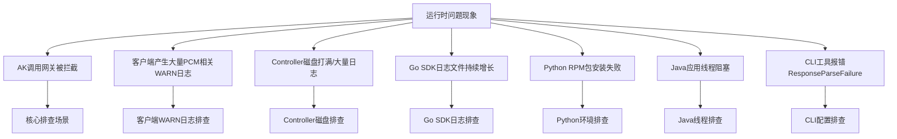

# 运维指导-运维手册

### UMMAK 数据库
- **服务与实例信息**：
  - service：`baseService-umm-ak`
  - db实例：`ummak`
  - 数据库：`ummak`
- **常用表**：
  - `accesskey_table`：存储 AK 的基础信息与状态（包括 `access_id`、`access_key`、`user_id`、`enabled_flag`、`hidden_flag`、`deleted_flag` 等字段）。

### PCM 数据库
- **服务与实例信息**：
  - service：`certificate-lifecycle-manager-server`
  - db实例：`clm_db`
  - 数据库：`pcm_db`
- **常用表**：
  - `init_ak_info`：存储 PCM 托管的底表 AK 信息（如 `umm_ak_status` 状态字段）。
  - `ak_info`：存储派生 AK 信息（如 `access_key_id` 等），用于查询派生 AK 是否存在及状态。

## 关键日志路径与轮转策略

### PCM Controller 日志
- **组件**：PCM Controller
- **日志路径**：`/home/admin/pcm_controller/logs/api/logs/`
- **内容与轮转策略**：记录 Controller 的 API 请求与处理日志。需确认日志轮转配置是否正常，若未正常轮转或存在大量异常请求/定时任务循环报错，会导致日志文件超大并打满磁盘。

### PCM Core (Nginx) 日志
- **组件**：PCM Core
- **日志路径**：`access.log`
- **内容与轮转策略**：记录 Core 层的访问日志，包含 `limit_req_status` 等限流状态字段，用于排查 502 限流问题。

### SDK 日志
- **Go SDK**：2512 之前版本存在日志轮转 Bug，会导致日志文件持续增长未按预期轮转。
- **Java SDK**：WARN 级别日志较多，部分产品可能会屏蔽报错日志，导致缺少请求 PCM 的 RequestId 等关键信息。

## 问题排查与应急处置 SOP

### 应急操作优先级原则
应急操作优先建议控制台白屏操作，当白屏无法访问时，采用在容器中执行脚本（调用服务接口），当容器无法访问时，直接在数据库中执行 SQL。
**优先级：控制台白屏 > 调用接口（容器脚本） > 数据库执行 SQL**

### 场景一：启用某个已经禁用的 initAK
**适用场景**：确认因为某把 initAK 被禁用而影响业务。

1. **白屏操作**：通过 PCM 控制台的 initAK 管理功能查询特定 AK，并在操作中启用该 AK。
2. **调用接口（容器中执行脚本）**：当白屏不可用时，采用此方案。在 PcmController 容器中使用底表AK黑屏操作工具执行启用命令：
   ```bash
   python3 manage_ak_status.py enable --ak {akid}
   ```
3. **数据库操作**：当白屏、容器均不可用时，采用此方案。
   - 进入 UMMAK 数据库（`ummak`）。
   - 执行 SQL 启用 AK：
     ```sql
     UPDATE accesskey_table SET enabled_flag=1 WHERE access_id = '{akid}';
     ```

### 场景二：启用全量底表 AK
**适用场景**：环境内存在被底表 AK 禁用而影响业务，涉及多把底表 AK 或无法确认某把底表 AK，可采用启用全量底表 AK。
> **注意**：暂不支持通过白屏解禁全量 AK。

1. **调用接口（容器中执行脚本）**：在 PcmController 容器中使用底表AK黑屏操作工具执行全量启用命令：
   ```bash
   python3 manage_ak_status.py enable-all
   ```
2. **数据库操作**：当容器不可访问时，采用此方案。
   - **步骤 1：获取全量底表 AK**
     - 进入 PCM 数据库（`clm_db` 实例的 `pcm_db` 数据库）。
     - 检索已经禁用的 initAK：
       ```sql
       USE pcm_db;
       SELECT access_key_id FROM init_ak_info WHERE umm_ak_status = 0;
       ```
   - **步骤 2：启用全量底表 AK**
     - 进入 UMMAK 数据库（`ummak` 实例的 `ummak` 数据库）。
     - 执行 SQL（将 `access_id` 字段参数改成步骤一中检索到的底表 AK 信息）：
       ```sql
       UPDATE accesskey_table SET enabled_flag=1 WHERE access_id IN ('akid1', 'akid2', 'akid3');
       ```

### 场景三：启用派生 AK
**适用场景**：确认某把派生 AK 被禁用影响业务。
> **注意事项**：每个派生队列中通过白屏仅可以查询最近 14 把派生 AK，如果超过 14 把 AK 后，会在 UMMAK 侧执行删除操作，但 PCM 数据库会保留派生 AK 记录。当通过白屏未查询到该 AK，有可能是 14 天前派生的 AK，可通过 PCM 数据库进行查询。

1. **白屏操作**：白屏支持查询派生 AK，查询后可通过启用操作恢复。
2. **数据库操作**：
   - **查询派生 AK**：进入 PCM 数据库（`clm_db` 实例的 `pcm_db` 数据库）进行查询。
     ```sql
     USE pcm_db;
     ```
   - **在 UMMAK 中启用**：进入 UMMAK 数据库（`ummak`）。
     - 如果 AK 存在，直接更新启用状态：
       ```sql
       UPDATE accesskey_table SET enabled_flag=1, hidden_flag=0, deleted_flag=0 WHERE access_id='{akid}';
       ```
     - 如果 AK 已经删除，重新创建 AK（需替换 `access_id`、`access_key`、`user_id`）：
       ```sql
       INSERT INTO `ummak`.`accesskey_table` (`access_id`, `access_key`, `user_id`) VALUES ('{akid}', '{sk}', '{uid}');
       ```

### 场景四：容量告警场景（AK 数量超限）
**适用场景**：UMMAK 侧每个 UID 下最大 1000 把有效 AK，当达到 1000 把以后会出现派生失败的情况。

1. **查询排查**：
   - 检查特定 UID 下的 AK 数量：
     ```sql
     SELECT user_id, COUNT(access_id) AS access_count FROM accesskey_table WHERE user_id = '{uid}' GROUP BY user_id;
     ```
   - 查询是否有 UID 下的 AK 超过 1000 把：
     ```sql
     SELECT user_id, COUNT(access_id) AS access_count FROM accesskey_table GROUP BY user_id HAVING access_count >= 1000;
     ```
2. **清理操作**：
   - 分析出环境内已经无用的 AK，在 UMMAK 中置成删除状态：
     ```sql
     UPDATE accesskey_table SET enabled_flag = 0, deleted_flag = 1, modified_time = UNIX_TIMESTAMP() WHERE access_id IN ('{akid1}', '{akid2}');
     ```

## 通用场景排查思路与常见问题

### 排查总览
以**问题现象**作为入口，引导排查思路：



### AK 调用网关被拦截
这是 PCM 接入后最核心的排查场景，产品调用网关时可能报 AK 被禁用/AK 无效/AK 不存在。首先需判断是否是 PCM 禁用 AK 导致。

**第一步：从网关日志中取出被拦截的 AK ID，在控制台查询是底表 AK 还是派生 AK。**
- **底表 AK 判定**：可以直接通过 PCM 控制台查询。
- **派生 AK 判定**：
  - 控制台仅可以查询每个队列最近 14 把派生 AK。
  - 数据库查询：进入 `clm_db` 实例的 `pcm_db` 数据库，执行 `select * from ak_info where access_key_id='****';` 检查是否存在。

#### 分支一：底表 AK 被拦截
**核心判断**：产品在使用底表 AK，说明 SDK 没有成功获取派生 AK，走了降级逻辑，或者使用底表 AK 未适配。排查方向是**为什么 SDK 没拿到派生 AK**。
1. **先恢复**：在 PCM 控制台启用该底表 AK，恢复业务。
2. **查 SDK 日志 code**：确认是哪种降级场景，参见下方“Core 错误码快速定位”。

#### 分支二：派生 AK 被拦截
**核心判断**：产品已经在使用派生 AK，但这把派生 AK 已被轮转禁用。排查方向是**为什么产品没有及时更新到最新的派生 AK**（最可能原因为：仅获取一次，未持续轮转）。
1. **恢复步骤**：通常重启服务会刷新 AK 导致可用，然后停止该队列的轮转。若无法重启服务，需手动启用 AK（参见应急处置 SOP）。
2. **排查步骤**：如果有 SDK 报错，参见下方“Core 错误码快速定位”。

#### 常见网关拦截日志特征及示例
当遇到访问报错，怀疑是 PCM 禁用 AK 导致的，优先通过拦截日志判定，提取日志中的请求 AK，并通过 PCM 服务查询 AK 状态。如果已经禁用，采用应急处置方案进行处置，并反馈研发侧排查原因。

##### OSS 拦截
- **特征**：`"error_code": "InvalidAccessKeyId"`，`"status": "403"`
- **日志示例**：
  ```json
  {"__tag__:__hostname__": "c25g07018.cloud.g07.amtest17", "__tag__:__pack_id__": "B06A0AF67C8DC2DB-1EF", "__tag__:__path__": "/apsara/module_logs/oss_tengine/access_log.2026042415", "__topic__": "", "acc_src_oms_region": "-", "access_id": "5hN1RkUhRn43iNfw", "bucket_enable": "-", "bucket_storage_type": "standard", "bucket_version": "1774332774", "bucketname": "cn-wulan-env17e-d01-as-console-cdn", "content_length_in": "-", "content_length_out": "476", "delta": "-", "error_code": "InvalidAccessKeyId", "host": "cn-wulan-env17e-d01-as-console-cdn.oss-cn-wulan-env17e-d01-a.intra.env17e.shuguang.com", "http_referer": "-", "in_length": "335", "ip": "10.17.46.36", "length": "476", "method": "GET", "objectname": "-", "objectsize": "-", "operation": "GetBucketAcl", "oss_acc_linetype": "-", "oss_data_location": "-", "oss_location": "oss-cn-wulan-env17e-d01-a", "oss_request_type": "-", "owner": "999999999", "process_type": "-", "ref_url": "aliyun-sdk-java/3.8.0(Linux/4.19.91-007.ali4000.alios7.x86_64/amd64;1.8.0_172)", "remote_port": "58066", "remote_user": "-", "request_id": "69EB1A0A3E6DA93539F3A4CE", "request_payer_account": "-", "requester": "-", "response_time": "0", "scheme": "http", "select_real_ip": "-", "sign_type": "-", "status": "403", "sync_direction": "-", "sync_source_bucket": "-", "sync_transfer_type": "-", "target_object_storage_class": "-", "time": "24/Apr/2026:15:21:46", "turn_around_time": "0", "url": "/?acl", "vpcaddr": "978325770", "vpcid": "0"}
  ```

##### SLS_INNER 拦截
- **日志示例**：
  ```json
  {"APIVersion": "0.6.0", "AccessKeyId": "cmchJQg057pBelHD", "Acl": "0", "AliUid": "", "CallerType": "Parent", "ClientIP": "10.17.160.103", "ConsumerGroup": "suspicous_group", "ExOutFlow": "0", "InFlow": "0", "Latency": "292", "Lines": "0", "LogStore": "big_data_event", "Method": "GetConsumerGroupCheckPoint", "NetFlow": "0", "OutFlow": "88", "ProjectId": "136", "ProjectName": "k8sblink", "RequestId": "69EB0C444B76F491098A2F35", "Source": "10.17.160.103", "Status": "401", "TunnelId": "0", "UserAgent": "aliyun-log-sdk-java-0.6.64/1.8.0_412", "UserId": "-2", "__THREAD__": "2418", "__tag__:__hostname__": "c25h05123.cloud.h06.amtest17", "__tag__:__pack_id__": "8ADDDFFBE647F7C-5", "__tag__:__path__": "/apsara/fcgi_agent/ols_operation_2.LOG", "__topic__": "", "microtime": "1777011780130296"}
  ```

##### SLSPUB 拦截
- **特征**：`"Status": "401"`，`"ErrorCode": "Unauthorized"`，`"ErrorMsg": "AccessKeyId is disabled: <AK_ID>"`
- **日志示例**：
  ```json
  {"__THREAD__": "80679", "Method": "ListShards", "Status": "401", "ClientIP": "10.17.31.30", "Latency": "70", "TunnelId": "", "NetFlow": "0", "UserId": "-2", "AliUid": "", "Acl": "0", "AccessKeyId": "Khz7a1kmKMZDCBXj", "Owner": "1000000004", "CallerType": "Parent", "ProjectName": "ali-cdsslshybridcluster-a-20260323-015f-sls-admin", "ProjectId": "2", "UserAgent": "aliyun-log-sdk-java-0.6.64/1.8.0_352", "APIVersion": "0.6.0", "RequestId": "69D6169B34510383396636E7", "Source": "10.17.31.30", "OutFlow": "87", "ExOutFlow": "0", "NetworkType": "intranet", "InFlow": "0", "LogStore": "sls_operation_agg_log", "RequestType": "unknown", "ErrorCode": "Unauthorized", "ErrorMsg": "AccessKeyId is disabled: Khz7a1kmKMZDCBXj", "microtime": "1775638171568514", "__topic__": "", "__tag__:__hostname__": "c25g09017.cloud.g09.amtest17", "__tag__:__path__": "/apsara/sls/fcgi_agent/ols_operation.LOG", "__tag__:__pack_id__": "6C68CE91F5F727CA-12A"}
  ```

##### ASAPI 拦截
- **特征**：`"errorCode": "asapi.server.request.parameter.accesskeyid.error"`，`"errorMessage": "The specified AccessKey ID (<AK_ID>) is invalid. Details: (The Access Key is disabled.)."`
- **日志示例**：
  ```json
  {"EagleeyeRpcId": "0.1.1", "EagleeyeTraceId": "0a11243f17770122001463084d0062", "LocalIp": "10.17.36.63", "__tag__:__hostname__": "vm010017036063", "__tag__:__pack_id__": "890EE1DC2FE689D1-774", "__tag__:__path__": "/apsara/cloud/data/asapi/ApiServer#/api-server/logs/asapi-logger/audit.log", "__topic__": "", "accessKeyId": "VidKjhddRaas4tMA", "apiId": "", "apiName": "ListAllLevel1Orgs", "apiVersion": "2019-05-10", "app": "api-server", "asapiHandleTime": "2026-04-24T06:30:00Z", "callerIp": "10.17.32.38", "callerRequestTime": "2026-04-24T06:30:00Z", "callerSource": "aso-ecsops", "category": "PassThrough", "cost": "148ms", "costMs": "148", "doForward": "", "domain": "internal.asapi.cn-wulan-env17e-d01.intra.env17e.shuguang.com", "endTime": "1777012200296", "errorCode": "asapi.server.request.parameter.accesskeyid.error", "errorMessage": "The specified AccessKey ID (VidKjhddRaas4tMA) is invalid. Details: (The Access Key is disabled.).", "errorSuggestion": "Check whether the AccessKey pair exists and is enabled.", "errorTitle": "The AccessKey pair in the request is invalid.", "errorType": "Business", "headers": "{\"x-acs-caller-sdk-language\":\"java\",\"x-acs-caller-sdk-version\":\"1.0.7.3-RELEASE\",\"User-Agent\":\"AlibabaCloud (Linux; amd64) Java/1.8.0_412-b0 Core/1.0.7.3-RELEASE\",\"Host\":\"internal.asapi.cn-wulan-env17e-d01.intra.env17e.shuguang.com\",\"Accept-Encoding\":\"gzip,deflate\",\"X-Tunnel-Id\":\"0\",\"x-acs-caller-sdk-source\":\"aso-ecsops\",\"x-acs-caller-ip\":\"10.17.32.38\",\"Version\":\"2019-05-10\",\"Signature\":\"yYR8ABsJ0HdFvrIP+cR+3aMhh2pIgA3Pdxjt1kTrBYU=\",\"X-Forwarded-For\":\"10.17.32.38\",\"request-source-domain\":\"internal.asapi.cn-wulan-env17e-d01.intra.env17e.shuguang.com\",\"request-source-type\":\"internal\",\"Content-Length\":\"284\",\"x-acs-content-sha256\":\"9f65af4562de665feb8671613e202f7657ed96edcdc13ca89bba634602a467a6\",\"eagleeye-rpcid\":\"0.1\",\"X-Real-IP\":\"10.17.32.38\",\"Content-Type\":\"application/json; charset=UTF-8\"}", "httpCode": "0", "httpMethod": "POST", "isPublic": "true", "language": "-", "message": "Failed to invoke ListAllLevel1Orgs/2019-05-10/ascm ", "organizationId": "1", "organizationTreeParse": "0.1.", "parameters": "{\"SignatureVersion\":\"2.1\",\"Action\":\"ListAllLevel1Orgs\",\"SignatureNonce\":\"9ad7af25-91d9-4bbd-af00-b49a1b715fc9\",\"Version\":\"2019-05-10\",\"AccessKeyId\":\"VidKjhddRaas4tMA\",\"Product\":\"ascm\",\"SignatureMethod\":\"HMAC-SHA256\",\"RegionId\":\"cn-wulan-env17e-d01\",\"Timestamp\":\"2026-04-24T06:30:00Z\"}", "passthroughMode": "", "productName": "ascm", "realIp": "10.17.32.38", "regionId": "cn-wulan-env17e-d01", "requestId": "0a11243f17770122001463084d0062", "requestSourceDomain": "internal.asapi.cn-wulan-env17e-d01.intra.env17e.shuguang.com", "response": "{\"openapiFullResult\":{\"data\":{\"eagleEyeTraceId\":\"0a11243f17770122001463084d0062\",\"asapiSuccess\":false,\"product\":\"ascm\",\"code\":\"asapi.server.request.parameter.accesskeyid.error\",\"cost\":0,\"errorType\":\"Business\",\"dynamicMessages\":[\"VidKjhddRaas4tMA\",\"The Access Key is disabled.\"],\"suggestion\":\"Check whether the AccessKey pair exists and is enabled.\",\"errorCode\":\"asapi.server.request.parameter.accesskeyid.error\",\"asapiVersion\":\"v4\",\"message\":\"The specified AccessKey ID (VidKjhddRaas4tMA) is invalid. Details: (The Access Key is disabled.).\",\"extInfo\":{\"exArgs\":[\"VidKjhddRaas4tMA\",\"The Access Key is disabled.\"]},\"serverRole\":\"asapi.ApiServer#\",\"asapiRequestId\":\"0a11243f17770122001463084d0062\",\"innerCall\":true,\"success\":false,\"domain\":\"internal.asapi.cn-wulan-env17e-d01.intra.env17e.shuguang.com\",\"asapiErrorMessage\":\"The AccessKey pair in the request is invalid.\",\"diagnose\":\"\",\"api\":\"ascm:ListAllLevel1Orgs:2019-05-10\",\"asapiErrorCode\":\"asapi.server.request.parameter.accesskeyid.error\"},\"success\":false,\"host\":\"internal.asapi.cn-wulan-env17e-d01.intra.env17e.shuguang.com\",\"asapiRequestId\":\"0a11243f17770122001463084d0062\",\"status\":500}}", "roleId": "", "serverRole": "asapi.ApiServer#", "sourceIp": "10.17.32.38", "starTime": "1777012200148", "status": "failed", "time": "2026-04-24 14:30:00:296", "userName": "NotAscmUser"}
  ```

##### KMS 拦截
- **特征**：`"error_code": "Forbidden.AccessKey"`，`"error_message": "This AccessKey is not enabled."`，`"status_code": "403"`
- **日志示例**：
  ```json
  {"URL": "ListKeys", "__FILE__": "logger.(*LoggerWrapper).Infof.func1", "__LEVEL__": "INFO", "__tag__:__hostname__": "c25h09107.cloud.h10.amtest17", "__tag__:__pack_id__": "328CDB3A9762DD42-BD9F", "__tag__:__path__": "/cloud/log/kms/KmsHost#/kms_host/audit.log", "__topic__": "", "accessroot": "1000000056", "accessuid": "1000000056", "action_trail": "{\"event_source\":\"kms-intranet.cn-wulan-env17e-d01.intra.env17e.shuguang.com\",\"useragent\":\"Python-urllib/3.6\",\"accesskeyid\":\"bpzC7chEgkHAFlsn\",\"callertype\":\"customer\",\"calleruid\":\"1000000056\",\"ip\":\"10.17.4.31\"}", "alias_name": "", "api_name": "ListKeys", "api_version": "2016-01-20", "cluster": "KmsCluster-A-20260323-018b", "cmkid": "", "cost": "7", "dest_alias_name": "", "dest_cmkid": "", "dest_encrypt_context": "", "dest_key_state": "", "dest_keyowner": "", "domain_id": "", "domain_type": "Intranet", "duration": "7678", "encrypt_context": "", "error_code": "Forbidden.AccessKey", "error_message": "This AccessKey is not enabled.", "expected_code": "403", "failed_status_code": "4XX", "host": "c25h09107.cloud.h10.amtest17", "host_0": "c25h09107.cloud.h10.amtest17", "initiatior_ip": "10.17.1.1", "ip": "10.17.4.31", "key_state": "", "keyowner": "", "log_type": "opr_log", "microtime": "1777017038585372", "protocol_version": "Ipv4", "protocol_vpc_id": "", "region_id": "cn-wulan-env17e-d01", "request": "{\"PageNumber\":\"1\",\"PageSize\":\"100\"}", "request_id": "0efdb6f6-ae55-445e-b1e9-f514351d287b", "response": "", "role": "customer", "server_type": "Nginx", "serverrole": "kms.KmsHost#", "status_code": "403", "tengine_conn_id": "681701", "tengine_tunnel_id": "0", "tls_cipher_suite": "ECDHE-RSA-AES128-GCM-SHA256", "tls_version": "TLSv1.2", "user_bid": "26842", "user_player": "", "user_type": "customer", "utc_time": "2026-04-24T07:50:38Z"}
  ```

##### ODPS 拦截
- **日志示例**：
  ```json
  {"__tag__:__hostname__": "vm010017037223", "__tag__:__pack_id__": "C36006E9E9CCCA0B-26F", "__tag__:__path__": "/cloud/log/odps-service-frontend/FrontendServer#/frontend_server/tengine/logs/aggregated_log.log", "__topic__": "", "count": "2", "execution_end_time": "2026-04-24T06:37:03.348203", "execution_start_time": "2026-04-24T06:37:01.586769", "log_earliest_time": "2026-04-24T06:35:00+08:00", "log_latest_time": "2026-04-24T06:35:00+08:00", "metadata": "{\"access_id\":\"fXWvhmRkMeER5QI6\",\"network_client_ip\":\"10.17.37.83\",\"vpc_id\":\"0\"}", "requests": "{\"url\":[\"/api/logview/host?curr_project=admin_task_project\",\"/api/projects?expectmarker=true&curr_project=admin_task_project\"]}"}
  ```

### 客户端产生大量 PCM 相关 WARN 日志
- **现象**：产品日志中大量 `Failed to refresh credential, pcm server is xxx`。2507 版本 PCM 服务端尚未部署，或部分产品升级至 3186-2510 及以上版本但 baseServiceAll 未升级时，均可能出现。
- **关键判断**：这类 WARN 日志**不影响业务**（SDK 已降级返回原始凭证），主要影响是客户端告警监控被触发，如果调用非常频繁可能产生大量错误日志。

### PCM Controller 磁盘打满 / 产生大量日志
- **现象**：Controller 日志目录 `/home/admin/pcm_controller/logs/api/logs/` 下出现超大文件，磁盘空间不足。
- **处理方式**：
  1. 确认磁盘使用情况：`df -h`
  2. 查看日志目录大小：`du -sh /home/admin/pcm_controller/logs/api/logs/`
  3. 清理历史日志文件（保留最近日志）。
  4. 排查产生大量日志的原因：是否有大量异常请求持续打到 Controller，或是否有定时任务异常导致循环报错。
  5. 确认日志轮转配置是否正常。

### SDK 与 CLI 工具常见问题

#### Go SDK 日志文件持续增长
- **现象**：Go SDK 产生的日志文件不断增大，未按预期轮转。
- **原因**：Go SDK 在 2512 之前版本存在日志轮转 Bug。
- **解决方案**：升级 Go SDK 至 2512 及以上版本。临时处理可使用 `> logfile` 截断日志文件（不要 rm 正在写入的文件）。

#### Python SDK RPM 包安装失败
- **现象**：安装 `pcm-python2-sdk-rpm-with-no-six` 报错，关键字包含 `pytz/zoneinfo`、`cpio: File from package already exists as a directory`。
- **原因**：系统已有 `/home/tops/lib/python2.7/site-packages/pytz/` 目录，与 RPM 包冲突。
- **解决方式**：
  ```bash
  mv /home/tops/lib/python2.7/site-packages/pytz /home/tops/lib/python2.7/site-packages/pytz_bak
  sudo yum install pcm-python2-sdk-rpm-with-no-six -y
  ```

#### Java 应用线程阻塞
- **现象**：线程 dump 中出现阻塞堆栈 `java.lang.Thread.State: BLOCKED (on object monitor) at sun.security.provider.NativePRNG$RandomIO.implNextBytes...`。
- **原因**：SDK 默认使用 `/dev/random` 阻塞模式获取随机数，系统熵值低（< 100）时线程被卡住。
- **解决方案**：升级 SDK 至 `credprovider.plugin >= 1.0.8`。临时规避可添加 JVM 参数 `-Djava.security.egd=file:/dev/./urandom`。

#### CLI 工具报错 ResponseParseFailure
- **现象**：返回 `{"code": "ResponseParseFailure", "data": "", "message": "xxxxxxx"}`。
- **原因**：`pcm_endpoint` 地址不对，该地址响应 200 但格式非预期，CLI 解析失败且未走降级。
- **排查**：确认 CLI 的 `pcm_endpoint` 指向正确的 PCM Core 地址，手动 curl 确认返回格式（后续版本已优化解析异常的降级处理）。

### Core 错误码快速定位

#### HTTP 400 — 请求参数错误
| 返回 Msg | 报错原因 | 排查方向 |
| --- | --- | --- |
| `SecretName or x_acs_bearer_token is nil` | SecretName 或 token 为空 | SDK 侧 initakid 和 pcm_endpoint 是否正确 |
| `SecretName parse fail, SecretName:xxxx` | SecretName 格式错误 | appName 是否正确以 `:` 分隔 |
| `The access key (AK) is not administered by the PCM service, AK:xxxx` | akid 非底表 AK | initakid 是否填写正确的底表 akid |
| `genJwtKey fail` | 计算 token_key 失败 | Core 内部问题，与 SDK 无关 |
| `Error in AK rotation led to unsuccessful request to the controller...` | 请求 Controller 派生失败 | 1. 派生 AK 容量达上限<br>2. IAMID 非法且关闭了非标开关 |

#### HTTP 403 — 认证失败
| 返回 Msg | 报错原因 | 排查方向 |
| --- | --- | --- |
| `reason: signature error` | 签名验证失败 | 见下方 signature error 排查 |
| `reason: "nbf" claim not valid until` | 时钟不同步 | 见下方 nbf 时钟偏差 |