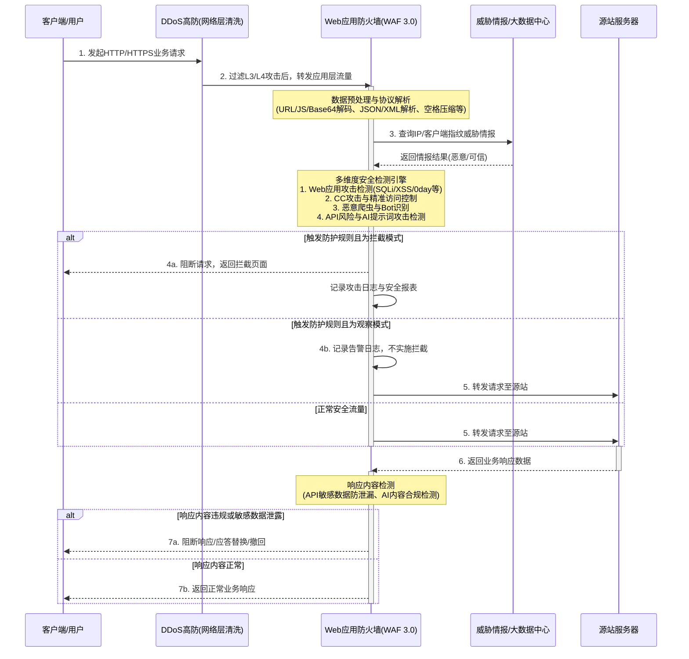

# 业务逻辑时序图

在构建纵深防御体系时，业务流量通常先经过 DDoS高防 进行网络层（L3/L4）大流量清洗，随后进入 WAF 进行应用层（L7）的深度安全防护。WAF 3.0 的核心业务逻辑主要围绕“流量接入 -> 数据预处理 -> 多维度安全检测 -> 处置与转发 -> 响应合规检测”的闭环展开。

以下时序图详细展示了客户端请求经过 WAF 时的系统交互与工作流流转，涵盖了深度检测技术、观察模式、API 风险检测及 AI 应用防护等核心机制：

**核心流转说明：**
1. **流量接入与预处理**：流量经过网络层清洗后进入 WAF，WAF 首先对 HTTP 协议数据进行全解析与多重解码，为检测引擎提供精确的数据源以降低误报率。
2. **多维检测与情报联动**：结合阿里云大数据威胁情报，WAF 并行执行 Web 攻击、CC 防护、爬虫识别以及 API/AI 专项检测。
3. **策略处置（含观察模式）**：对于新上线业务，可启用“观察模式”，对疑似攻击仅生成告警而不拦截，便于统计误报；对于确认的恶意流量则直接阻断。
4. **双向防护与响应检测**：WAF 不仅检测入站请求，还对源站返回的响应内容进行合规性与敏感数据流转检测，实现端到端的全链路防控。