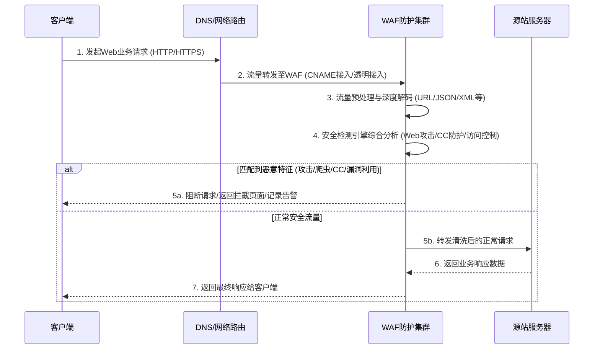

# 业务逻辑时序图

Web应用防火墙（WAF）的核心业务逻辑主要围绕流量的接入、检测、清洗与回源展开。无论是通过修改DNS解析的CNAME接入，还是无需修改DNS的透明接入，其核心的流量处理时序如下：

**核心流程说明：**

1. **流量接入**：客户端发起Web请求，通过CNAME接入（修改DNS解析记录）或透明接入（云原生直接引流）方式，将请求流量统一转发至WAF防护集群。具体的接入配置方式可参见添加域名与透明接入。
2. **预处理与检测**：WAF接收到流量后，对多种常见HTTP协议数据格式（如Form表单、JSON、XML）及复杂编码进行深度解析与预处理，随后交由Web应用安全防护、CC恶意攻击防护、精准访问控制等引擎进行综合研判。
3. **流量清洗与处置**：
   - **恶意流量**：若识别到SQL注入、XSS跨站、WebShell上传、CC攻击等威胁特征，WAF将直接阻断请求并清洗恶意流量，保障源站不被入侵（若开启观察模式则仅告警不阻断）。
   - **正常流量**：若流量安全合规，WAF将正常、安全的流量透传转发至源站服务器。
4. **业务响应**：源站服务器处理业务逻辑后，将响应数据返回给WAF，WAF最终将响应回传给客户端，完成一站式安全防护闭环。