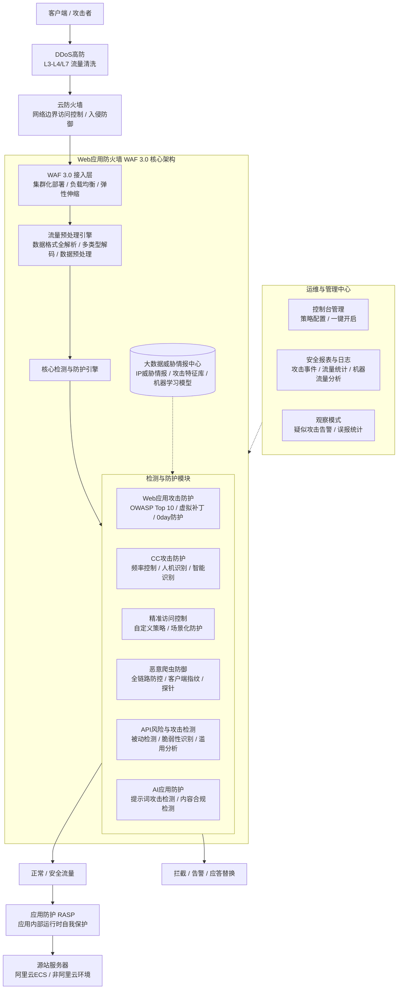

# 完整架构图

**架构模块与业务流说明**

*   **纵深防御体系**：在流量入口处，建议采用“[[DDoS/DDoS高防/index|DDoS高防]]+云防火墙+WAF”的组合架构。DDoS高防负责L3-L4及L7层的大流量清洗，云防火墙负责网络边界的访问控制与入侵防御，WAF 3.0 专注于HTTP/HTTPS应用层的深度解析与防护。
*   **WAF 3.0 内部架构**：
    *   **接入层**：采用集群化部署与内置负载均衡策略，消除单点故障，并支持根据实际流量弹性伸缩，实现5分钟内快速部署与激活。
    *   **预处理层**：对HTTP常见协议数据格式进行全解析（如Form、JSON、XML等），支持多种编码解码（如URL、Base64、混合嵌套等），并通过空格压缩、注释删减等机制进行数据预处理，为检测引擎提供精确数据源。
    *   **检测引擎层**：包含Web攻击防护、CC防护、精准访问控制、恶意爬虫防御、API风险检测及AI应用防护六大核心模块，结合大数据威胁情报中心进行智能识别与拦截。
*   **应用内部协同**：WAF 3.0 将清洗后的正常流量转发至源站，建议结合 应用防护RASP 构建应用内部与边界协同的双重安全体系，RASP 专注于防御0day漏洞利用及加密流量攻击等应用层威胁。

**已知问题和注意事项**

*   **网站隐身保护**：WAF 默认不对攻击者暴露网站服务器真实地址。配置时需确保源站安全组或防火墙仅允许 WAF 回源 IP 访问，避免攻击者绕过 WAF 直接攻击源站。
*   **新业务上线建议**：针对新上线网站业务，建议先启用“观察模式”。该模式下对触发防护规则的疑似攻击行为仅生成告警而不实施拦截，便于统计误报情况并优化防护策略。
*   **API与AI防护特性**：API风险检测基于被动流量检测，支持全生命周期管理且对业务无侵扰；AI应用防护支持请求和响应内容的合规性检测，并可通过应答替换及撤回实现实时阻断。
*   **合规与资质**：WAF 作为标准云产品，已具备等保三级、PCI DSS、ISO 27001、SOC 1/2/3 等多项国际权威认证，在云平台层面具备与阿里云同等水平的安全合规资质。