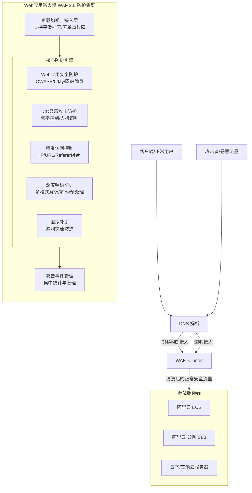

# 完整架构图

Web应用防火墙（WAF）2.0 的[[DDoS/DDoS基础防护/产品对内文档/完整架构图|完整架构图]]展示了从用户请求接入、流量清洗到回源的完整业务流，以及 WAF 内部的模块划分与高可用集群设计。

**架构模块与业务流说明**

*   **接入层**：支持两种主要接入方式，将网站域名接入到 WAF 进行防护。
    *   **CNAME 接入**：适用于源站部署在云上或云下的场景。通过修改域名 DNS 解析（设置 CNAME 记录），将 Web 请求转发至 WAF。
    *   **透明接入**：适用于源站为阿里云 ECS 或公网 SLB 的场景。无需修改 DNS 解析，通过云原生方式直接将源站请求流量转发至 WAF。
*   **WAF 防护集群**：采用集群方式提供服务，支持多种负载均衡策略。具备平滑扩容能力（可根据流量缩减或增加服务器），且无单点故障问题，确保服务的高可靠性。
*   **核心防护引擎**：
    *   **Web 应用安全防护**：防御 OWASP 常见威胁（如 SQL 注入、XSS 等）、0day 漏洞，支持网站隐身和友好的观察模式。
    *   **深度精确防护**：支持全解析多种 HTTP 协议数据格式（Form、JSON、XML 等）及常见编码类型解码，提供预处理机制，降低误报率。
    *   **CC 恶意攻击防护**：基于频率控制、人机识别，结合大数据威胁情报与可信访问分析模型，快速识别并防御海量慢速请求等恶意流量。
    *   **精准访问控制**：支持基于 IP、URL、Referer 等 HTTP 常见字段的条件组合策略，轻松识别可信与恶意流量。
    *   **虚拟补丁**：在 Web 应用漏洞补丁发布和修复之前，通过调整防护策略实现快速防护。
*   **攻击事件管理**：对攻击事件、攻击流量和攻击规模进行集中的管理与统计。
*   **源站服务器**：经过 WAF 识别、清洗和过滤后的正常、安全流量，最终被返回给源站服务器（如阿里云 ECS、公网 SLB 或云下服务器），避免服务器被恶意入侵，保障业务和数据安全。

**已知问题和注意事项**

*   **接入限制**：WAF 仅支持通过**域名**方式进行防护，**不支持**使用 IP 直接接入。
*   **透明接入环境限制**：透明接入模式仅支持源站服务器为阿里云 ECS 或部署在阿里云公网 SLB 上的场景；若源站部署在云下或其他环境，必须使用 CNAME 接入方式。
*   **协议支持**：业务配置目前主要支持对网站的 HTTP、HTTPS 流量进行安全防护。