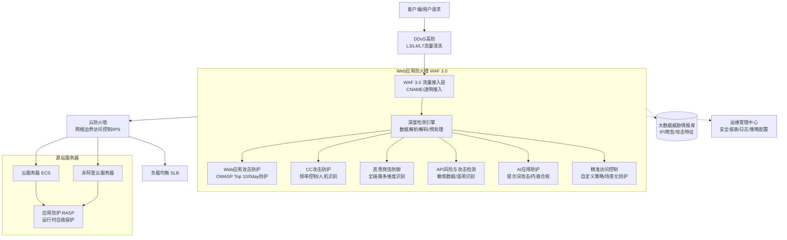

# 服务介绍

**产品定位**
阿里云[[WAF/Web应用防火墙/index|Web应用防火墙]]（WAF 3.0）是一款专注于HTTP/HTTPS业务层的安全防护产品。通过对网站或App的业务流量进行恶意特征识别和防护，帮助抵御常见的Web攻击。WAF对流量进行清洗和过滤，将正常、安全的流量转发至服务器，防止恶意请求影响网站正常运行，有效保护业务稳定和数据安全。适用于网站服务器部署在阿里云或非阿里云环境的各类用户，广泛支持金融、电商、O2O、互联网+、游戏、政府、保险等各行业场景。

**演进历程**
WAF源自阿里巴巴集团逾十年的网络安全实践，具备支撑淘宝、天猫、支付宝等高并发、高安全要求场景的技术能力。当前主力版本为WAF 3.0，融合了大数据智能驱动与AI应用防护等前沿能力，依托全球领先的IP威胁情报库，持续迭代攻击识别模型，提升威胁识别的准确性与覆盖范围。

**涉及产品与组件**
核心能力涵盖Web应用攻击防护、CC攻击防护、精准访问控制、恶意爬虫流量防御、API风险与攻击检测、AI应用防护等安全组件，并提供高可靠与弹性伸缩的平台架构及简易的运维管理组件。

## 对外介绍架构图

WAF 3.0 在整体安全架构中处于应用层流量清洗的核心位置，向上承接经过 DDoS 高防清洗后的流量，向下将安全流量回源至 ECS、SLB 等源站服务器，并与云防火墙、RASP 等产品构建纵深防御体系。

## 各核心组件能力详细说明

**Web应用攻击防护**
*   **抵御常见威胁**：有效防御 OWASP Top 10 中定义的常见攻击，包括SQL注入、XSS跨站、WebShell上传、后门攻击、命令注入、非法HTTP协议请求、CSRF、核心文件非授权访问、路径穿越等。
*   **网站隐身**：不对攻击者暴露网站服务器地址，避免其绕过WAF直接攻击。
*   **虚拟补丁与0day防护**：在官方安全补丁发布前，通过快速更新防护规则，为高危漏洞（包括 0day 漏洞）提供及时有效的虚拟补丁。
*   **友好的观察模式**：针对新上线网站业务启用观察模式，对触发防护规则的疑似攻击行为仅生成告警而不实施拦截，便于统计误报情况。
*   **深度检测技术**：支持对 HTTP 常见协议数据格式进行全解析（任意头部字段、Form表单、Multipart、JSON、XML）；支持解码多种常见编码类型（URL、JavaScript Unicode、HEX、HTML实体、Java/PHP序列化、Base64、UTF-7/8、混合嵌套等）；通过空格压缩、注释删减等数据预处理机制降低误报率。

**CC攻击防护**
*   **多维度攻击识别**：基于单一源 IP 的访问频率控制；通过重定向跳转、人机识别等方式验证访问者身份；结合统计响应码、URL 请求分布、异常 Referer 及 User-Agent 等特征进行智能识别。
*   **大数据威胁情报**：充分利用阿里云大数据安全优势，建立威胁情报与可信访问分析模型，快速识别恶意流量。

**精准访问控制**
*   **自定义防护策略**：提供友好的控制台界面，支持IP、URL、Referer、User-Agent等HTTP常见字段的条件组合，配置强大的精准访问控制策略。
*   **场景化防护**：支持盗链防护、网站后台保护等场景。
*   **多层综合保护**：与Web常见攻击防护、CC防护等安全模块结合，搭建多层综合保护机制。

**恶意爬虫流量防御**
*   **机器流量分析报表**：对机器流量进行恶意、疑似、友好分类，通过报表展示流量趋势及风险客户端信息。
*   **全场景防护支持**：全面支持网页、H5、原生APP（IOS、Android、鸿蒙）、小程序（微信、支付宝）等客户端环境集成。
*   **端到端全链路防控**：覆盖100+种浏览器探针特征、7000+种客户端指纹、100万+恶意爬虫威胁情报以及6种高级爬虫识别算法。

**API风险与攻击检测**
*   **开箱即用**：一键开启检测，基于被动流量检测，支持对API接口全生命周期的管理，监控敏感数据流转，对业务无侵扰。
*   **风险发现**：检测API接口脆弱性，识别未授权敏感数据泄露、内部接口对外暴露等问题，并提供修复建议。
*   **威胁检测**：基于跨会话双向流量分析，识别API滥用行为（如接口数据遍历爬取、暴力破解等），支持联动WAF进行处置。

**AI应用防护**
*   **提示词攻击检测**：专业防御针对生成式AI的注入式攻击，精准识别越狱指令、角色扮演诱导、系统指令篡改等对抗性攻击行为。
*   **内容合规检测**：支持请求和响应内容的合规性检测，确保所有交互内容符合安全和法规要求。
*   **实时防护与响应**：结合拦截、应答替换及撤回等防护措施，实现对异常行为的实时阻断和响应内容的自动替换。

**运维管理与架构可靠性**
*   **简易部署与运维**：5分钟内部署和激活，无需安装软硬件或调整路由；通过安全报表与日志集中管理统计攻击事件。
*   **高可靠与弹性伸缩**：采用集群化部署消除单点故障；内置多种负载均衡策略；可根据实际流量情况弹性缩减或增加集群服务器数量。

## 与阿里云其他产品的关系

**与 VPC、ECS、SLB 等产品的交互方式及影响**
*   **交互方式**：WAF 支持通过 CNAME 接入或透明接入的方式，将公网流量引流至 WAF 进行清洗。清洗后的正常 HTTP/HTTPS 流量会回源至后端的 ECS 实例、SLB 负载均衡或 VPC 内的其他计算资源。对于非阿里云环境的服务器，WAF 同样支持通过公网回源。具体接入操作可参见为ECS实例接入WAF防御CC攻击。
*   **产生的影响**：WAF 作为反向代理或透明网关，会接管公网入向的 Web 流量。开启 WAF 后，源站 ECS/SLB 的公网 IP 可以被隐藏（网站隐身），避免被直接攻击。WAF 的拦截和清洗动作直接影响最终到达源站的请求质量和数量，大幅降低源站的负载压力和安全风险。

**产品异常的影响边界**
*   **可能造成的影响**：若 WAF 集群出现极端异常或配置错误（如误拦截、回源路由配置错误），可能导致正常的 HTTP/HTTPS 业务流量被拦截或无法访问源站；若未配置 Bypass 机制，WAF 故障可能导致接入 WAF 的域名业务中断。
*   **不会造成的影响**：WAF 仅处理应用层（L7）的 HTTP/HTTPS 流量，其异常**不会**影响网络层/传输层（L3/L4）的非 Web 流量（如 SSH、RDP、数据库端口访问等）；**不会**影响 VPC 内部的东西向流量；**不会**导致源站 ECS 服务器本身宕机或操作系统崩溃。

**与其他安全产品的协同与区别**
在构建纵深防御体系时，建议采用“[[DDoS/DDoS高防/index|DDoS高防]]+云防火墙+WAF”的组合架构。同时，WAF 与应用防护 RASP 属于互补性技术，建议根据业务需求同时部署，构建应用内部与边界协同的双重安全体系。更多 RASP 详情可参见接入应用防护。

| **云产品** | **Web应用防火墙 (WAF)** | **云防火墙 (CFW)** | **DDoS高防** |
| --- | --- | --- | --- |
| 防护层级 | 应用层 (L7) | 网络层/传输层 (L3-L4) | 网络层/传输层 (L3-L4)与应用层 (L7) |
| 核心机制 | 语义分析、规则匹配、行为建模 | 访问控制策略、状态检测、入侵防御系统 | 流量清洗、特征过滤、带宽扩容 |
| 可防御的攻击 | SQL注入、XSS跨站、Webshell上传、CC攻击、恶意机器爬虫、API滥用 | 端口扫描、暴力破解、未授权访问、挖矿蠕虫、东西向流量威胁 | SYN Flood、UDP Flood等L3/L4流量型攻击，高频CC攻击等L7应用层攻击 |
| 适用场景 | 需防御网站/APP被篡改、恶意访问、爬虫或API接口被滥用。 | 需统一管控云资产公网出入口访问策略，防止服务器被暴力破解或内网横向扩散。 | 需保障业务在大流量攻击下不瘫痪、不丢包，确保网络链路畅通。 |

*注：WAF 已通过 ISO 9001、ISO 27001、等保三级、PCI DSS 等多项国际权威认证，在云平台层面具备与阿里云同等水平的安全合规资质。详细内容请参见阿里云信任中心。更多产品信息请参见Web应用防火墙产品页面。*