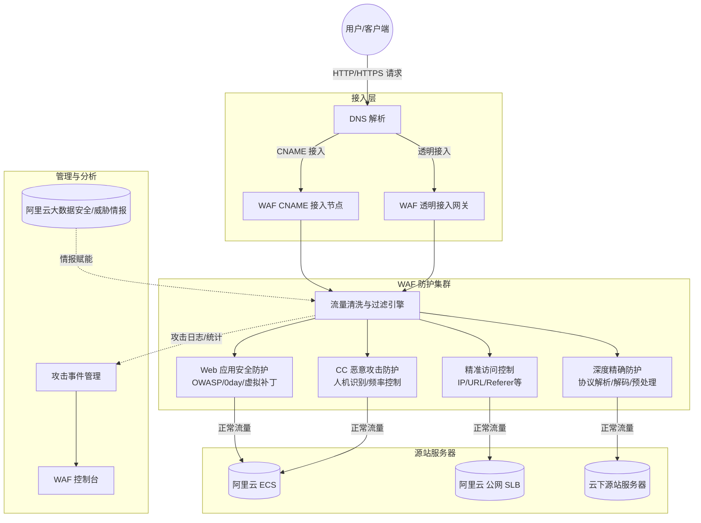

# 服务介绍

*   **产品定位**：阿里云Web应用防火墙（WAF）为网站或App业务提供一站式安全防护。通过有效识别Web业务流量的恶意特征，对流量进行清洗和过滤，将正常、安全的流量返回给服务器，避免网站服务器被恶意入侵导致性能异常等问题，从而保障网站的业务安全和数据安全。适用于金融、电商、O2O、互联网+、游戏、政府、保险等行业各类网站的Web应用安全防护。
*   **版本演进**：当前主要版本为 **WAF 2.0**，在原有防护能力基础上，进一步深化了精确防护、CC恶意攻击防护及精准访问控制等能力，并集成了大数据威胁情报与可信访问分析模型，提供更为精细、准确的数据源和更低的误报率。
*   **涉及产品与组件**：能力涉及 Web应用防火墙 控制台、防护集群、DNS解析组件、透明接入网关等。

## 对外介绍架构图

## 各核心组件能力详细说明

| 核心组件/功能模块 | 能力详细说明 |
| --- | --- |
| **Web应用安全防护** | 防御OWASP常见威胁（SQL注入、XSS跨站、WebShell上传、后门攻击等）；支持网站隐身避免绕过攻击；提供0day补丁及时更新；支持友好的观察模式（针对新上线业务只告警不阻断）。 |
| **深度精确防护** | 支持全解析多种常见HTTP协议数据格式（Form、JSON、XML等）；支持解码常见编码类型（URL、Base64、UTF-8等）；支持预处理机制（空格压缩、注释删减等），提供精细准确的数据源，降低误报率。 |
| **CC恶意攻击防护** | 控制单一源IP访问频率，基于重定向跳转验证、人机识别等；针对海量慢速请求攻击，结合统计响应码、URL分布及精准防护规则综合防护；利用大数据建立威胁情报与可信访问分析模型。 |
| **精准访问控制** | 支持IP、URL、Referer、User-Agent等HTTP常见字段的条件组合，配置精准访问控制策略；支持盗链防护、网站后台保护等场景。 |
| **虚拟补丁** | 在Web应用漏洞补丁发布和修复之前，通过调整Web防护策略实现快速防护。 |
| **攻击事件管理** | 支持对攻击事件、攻击流量、攻击规模的集中管理统计。 |
| **接入组件（CNAME/透明）** | **CNAME接入**：通过修改DNS解析将Web请求转发到WAF，适用于云上、云下源站。 **透明接入**：无需修改DNS解析，直接将源站请求流量转发到WAF，适用于源站为ECS或阿里云公网SLB的场景。 |

## 与阿里云其他产品的关系

**与 Top 30 产品的交互方式及影响**

*   **ECS（云服务器）**：
    *   **交互方式**：WAF 可通过透明接入模式直接引流 ECS 的公网流量，或通过 CNAME 接入将清洗后的流量回源至 ECS。
    *   **影响**：WAF 能够隐藏 ECS 的真实 IP，避免 ECS 直接暴露在公网遭受恶意攻击，保障 ECS 内部业务的安全与稳定运行。
*   **SLB（负载均衡）**：
    *   **交互方式**：WAF 支持对部署在阿里云公网 SLB 上的业务进行透明接入，或将清洗后的流量回源至 SLB。
    *   **影响**：WAF 与 SLB 结合，在 SLB 分发流量前进行安全清洗，避免恶意流量占用 SLB 及后端服务器的连接数和带宽资源。
*   **DNS（云解析 DNS）**：
    *   **交互方式**：在 CNAME 接入模式下，用户需要在 DNS 控制台修改域名的解析记录，将其指向 WAF 分配的 CNAME 地址。
    *   **影响**：DNS 解析的生效速度和稳定性直接影响 WAF 接入的生效时间以及业务流量的正常调度。

**产品异常造成的影响与边界**

*   **可能造成的影响**：
    *   若 WAF 防护集群出现异常或网络故障，可能导致经过 WAF 的 Web 业务流量中断，用户无法正常访问网站或 App。
    *   若 WAF 防护规则配置不当（如误拦截），可能导致正常用户的合法请求被阻断，影响业务可用性。
*   **不会造成的影响（边界清晰）**：
    *   **不影响源站自身运行**：WAF 异常不会导致后端 ECS、SLB 或云下源站服务器宕机或系统崩溃。
    *   **不影响非 Web 流量**：WAF 仅针对 HTTP/HTTPS 等 Web 业务流量进行防护，源站的非 Web 端口（如 SSH、RDP、数据库端口等）及其他网络层协议不受 WAF 异常影响。
    *   **不改变底层路由**：WAF 仅支持通过域名方式进行防护，不支持使用 IP 直接接入，因此不会改变或影响源站 IP 本身的网络底层路由配置。