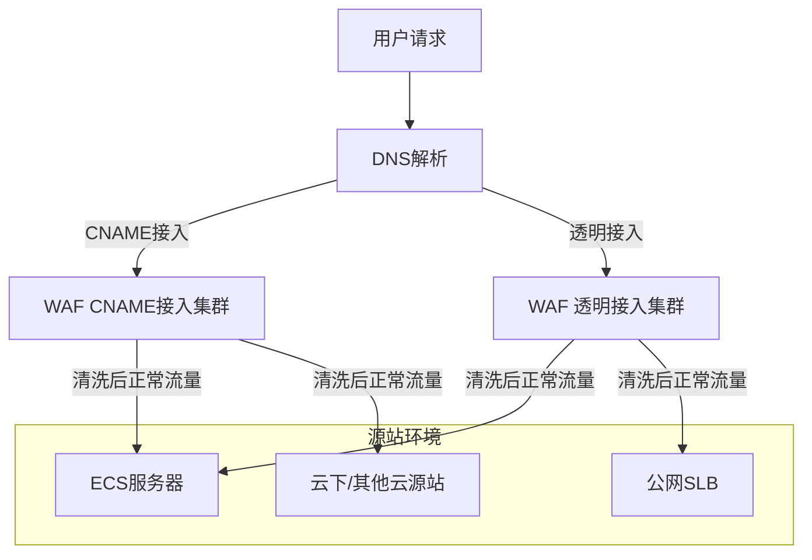

# 横向研发文档

WAF仅支持通过域名方式进行防护，不支持使用IP直接接入。购买WAF后，可通过以下两种方式将网站域名接入WAF进行防护：

*   **CNAME接入**
    *   **适用场景**：源站服务器部署在云上或云下。
    *   **对接方式**：在WAF控制台添加需要防护的网站信息，并修改网站域名的DNS解析（设置CNAME解析记录），将网站的Web请求转发到WAF进行防护。详细操作请参见添加域名。
*   **透明接入**
    *   **适用场景**：源站服务器为ECS服务器或者部署在阿里云公网SLB上。
    *   **对接方式**：采用云原生的透明接入，在WAF控制台添加网站信息后，无需修改域名的DNS解析设置，即可将源站请求流量转发到WAF进行防护。详细操作请参见透明接入。

## 产品对接方案细节

在对接WAF进行安全防护时，涉及以下核心方案细节与功能配置：

| **对接模块** | **方案细节说明** |
| --- | --- |
| **业务协议配置** | 支持对网站的HTTP、HTTPS流量进行安全防护配置。 |
| **Web应用安全防护** | - **常见威胁防御**：防御SQL注入、XSS跨站、WebShell上传、命令注入等OWASP常见威胁。 - **网站隐身**：隐藏站点地址，避免绕过WAF直接攻击。 - **观察模式**：新业务上线可开启观察模式，对疑似攻击只告警不阻断，便于统计误报。 |
| **深度精确防护** | - **数据解析**：全解析多种HTTP协议数据格式（任意头部字段、Form表单、JSON、XML等）。 - **解码与预处理**：支持URL、Base64等多种编码解码，支持空格压缩、注释删减等预处理，提供精细数据源。 |
| **CC恶意攻击防护** | 控制单一源IP访问频率，基于重定向跳转、人机识别、统计响应码及URL分布等特征，结合大数据威胁情报模型识别恶意流量。 |
| **精准访问控制** | 支持基于IP、URL、Referer、User-Agent等HTTP常见字段的条件组合配置访问控制策略，支持盗链防护和后台保护。 |
| **高可用与扩容** | - **负载均衡**：集群方式提供服务，支持多种负载均衡策略。 - **平滑扩容**：根据实际流量弹性缩减或增加集群服务器数量。 - **无单点故障**：单台服务器宕机不影响正常服务。 |

## 产品对接范围

*   **适用网络环境**：适用于阿里云以及阿里云外所有用户的源站环境。
*   **适用行业场景**：主要用于金融、电商、O2O、互联网+、游戏、政府、保险等行业各类网站的Web应用安全防护。
*   **防护对象限制**：仅支持通过**域名方式**进行防护，不支持使用IP直接接入。
*   **合规与资质范围**：对接WAF的业务可继承其合规资质，包括ISO 9001/20000/22301/27001/27017/27018/27701/29151、BS 10012、CSA STAR、等保三级、SOC 1/2/3、C5、HK金融、OSPAR、PCI DSS等多项国际权威认证，具备与阿里云同等水平的安全合规资质。