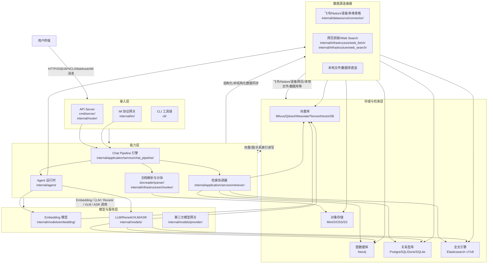

# 服务介绍

### 产品定位与演进历程

[[backend/WeKnora/index|WeKnora]] 是一个面向企业知识管理与智能协作的开源 RAG+Agent 混合架构平台，核心目标是将非结构化企业知识（文档、IM 记录、数据库、网页等）转化为可检索、可推理、可执行的智能资产，支撑问答、摘要、决策辅助、自动化任务等场景。它亦被定义为**企业级知识中枢系统**，基于多模态 RAG（检索增强生成）与智能体（Agent）架构，提供从多源文档解析、混合语义检索（向量/图/关系）、跨平台 IM 集成，到可编排技能工作流的全栈能力。

源内容中未提供明确的版本迭代历史或发布日志，无法提取各版本新增功能信息；但代码结构显示其持续强化以下方向，表明其演进主线为：  
✅ **从单模态文本 RAG 向多模态 RAG 深化**：新增 `internal/models/asr/`（语音识别）、`internal/models/vlm/`（视觉语言模型）等模块，支持音视频、图像等非文本模态理解；  
✅ **从静态知识库向动态 Agent 技能中枢演进**：强化 `internal/agent/skills/`、`examples/skills/` 及 MCP 工具标准（Model Context Protocol）支持，实现可声明、可审计、可组合的自动化工作流；  
✅ **从封闭部署向跨云、跨平台、可插拔生态扩展**：持续增加对 Milvus/Qdrant/Weaviate/TencentVectorDB/Elasticsearch/Doris/Neo4j/PostgreSQL 等多检索后端的支持，并拓展飞书、钉钉、企微、Slack、Telegram、Mattermost、微信等七大 IM 平台集成能力。

能力覆盖产品整体（WeKnora 知识中枢），核心组件包括：文档解析器（`docreader/`）、分块引擎（`internal/infrastructure/chunker/`）、多模态模型抽象层（`internal/models/`）、混合检索适配器（`internal/application/repository/retriever/`）、Agent 运行时（`internal/agent/`）、IM 协议网关（`internal/im/`）、技能编排框架（`internal/agent/skills/` + `internal/agent/tools/`）、知识源连接器（`internal/datasource/connector/`）及前端交互层（`frontend/`）。

### 对外介绍架构图

WeKnora 采用清晰分层、松耦合、可插拔的微服务架构设计，支持本地部署与云原生扩展。其对外服务架构体现为“四层三面”，亦可表述为**分层解耦、协议中立、多后端可插拔的云原生架构**，整体分为：

- **接入层**：统一 API 网关（`cmd/server/`, `internal/router/`）与多端 SDK（`client/`, `frontend/src/api/`），支持 CLI、Web 前端、桌面应用及第三方系统集成；同时作为 IM 协议网关（`internal/im/`），提供标准化消息收发接口，对接飞书、企微、Slack、Telegram、钉钉、微信、Mattermost 等主流平台；  
- **能力层**：模块化核心服务，包括 Chat Pipeline 引擎（`internal/application/service/chat_pipeline/`）、Agent 运行时（`internal/agent/`）、检索协调器（`internal/application/service/retriever/`）、文档解析与分块（`docreader/parser/`, `internal/infrastructure/chunker/`）；  
- **存储与检索层**：支持向量库（Milvus / Qdrant / Weaviate / TencentVectorDB）、图数据库（Neo4j）、关系型数据库（PostgreSQL / Doris / SQLite）、全文搜索引擎（Elasticsearch v7/v8）、对象存储（MinIO / OSS / S3）等异构存储的统一抽象与动态路由；  
- **基础设施层（模型与服务层）**：标准化封装 LLM、Embedding、Rerank、VLM、ASR 五类模型调用（`internal/models/`），支持 OpenAI 兼容协议、Ollama、本地模型及云厂商模型（如腾讯混元、阿里通义千问等通过 `internal/models/provider/` 接入），具备自动降级、负载均衡与缓存能力；  
- **集成层（数据源连接器）**：通过标准化 connector 实现与飞书、Notion、语雀、飞书多维表格、网页（`internal/infrastructure/web_fetch/`, `internal/infrastructure/web_search/`）、本地文件系统、数据库直连等主流知识源的双向同步与事件驱动交互。

数据流向以用户请求为起点，经认证、路由、会话构建后，由 Chat Pipeline 协调执行路径——可调用文档解析、混合检索、LLM 推理、工具调用或外部系统集成，并全程支持流式响应（`internal/stream/`, `cli/internal/sse/`）、异步任务（AsynqDL）、可观测性（`internal/tracing/langfuse/`, `internal/application/service/metric/`）与上下文透传。

### 各核心组件能力详细说明

- **文档解析器（`docreader/`）**：支持 PDF（含扫描件 OCR）、Office（.docx/.xlsx/.pptx）、Markdown、HTML、纯文本等数十种格式，内置 OCR（图像文字识别）、表格结构还原、公式解析能力；通过 `docreader/parser/` 实现格式无关的语义分段，输出结构化文档树，支持自定义规则与元数据提取。

- **智能分块引擎（`internal/infrastructure/chunker/`）**：提供语义感知分块（Semantic Chunking）、递归分块（Recursive Chunking）、重叠滑动窗口（Overlap Sliding）等多种策略，支持按标题层级、段落逻辑、代码函数边界等自定义切分规则，保障检索精度与上下文完整性。

- **混合检索适配器（`internal/application/repository/retriever/`）**：提供统一检索接口，底层可插拔对接向量库（Qdrant/Milvus/Weaviate/TencentVectorDB）、图数据库（Neo4j）、关系型数据库（PostgreSQL/Doris/SQLite）、全文引擎（Elasticsearch v7/v8）等 10+ 引擎；统一抽象向量检索（ANN）、关键词检索（BM25）、图遍历（Cypher/Gremlin）、SQL 查询、全文检索等能力，支持向量+关键词+图关系+结构化条件的联合查询与结果融合重排（Recall Fusion + Rerank）。

- **多模型服务适配层（`internal/models/`）**：标准化封装 LLM、Embedding、Rerank、VLM、ASR 五类模型调用，支持 OpenAI 兼容协议、Ollama、本地模型及云厂商模型（如腾讯混元、阿里通义千问等通过 `internal/models/provider/` 接入），具备自动降级、负载均衡与缓存能力。

- **Agent（`internal/agent/`）**：基于 ReAct / Plan-Execute 框架实现，内置短期记忆（Session Memory，`internal/handler/session/`）、长期记忆（Knowledge Base，`internal/agent/memory/`）、审批流（`internal/agent/approval/`）、Token 管控（`internal/agent/token/`）及工具调用调度（`internal/agent/tools/`）；全面支持 Model Context Protocol 标准，支持 JSON Schema 描述技能契约，实现安全可控的自动化执行。

- **IM 协议网关（`internal/im/`）**：提供标准化消息收发接口，已对接飞书、企微、Slack、Telegram、钉钉、微信（公众号/小程序）、Mattermost 七大主流平台，支持消息接收、富文本回复、卡片交互、按钮操作、文件上传/下载、会话上下文透传及组织架构同步，实现“知识即服务”在办公场景的无缝嵌入。

- **技能编排框架（`internal/agent/skills/` + `examples/skills/`）**：以声明式 YAML 或 Go 函数注册技能，支持参数校验、依赖注入、失败回滚、审计日志；示例含 PDF 智能摘要、会议纪要生成、数据库查询助手等，开发者可通过 `internal/agent/tools/` 快速接入自定义 HTTP、SQL、Shell 工具。

- **知识源连接器（`internal/datasource/connector/`）**：开箱即用对接 Notion、语雀、飞书知识库/多维表格等 SaaS 知识库，支持增量同步、变更捕获与权限映射；同时支持网页抓取（`internal/infrastructure/web_fetch/`）、Web Search（`internal/infrastructure/web_search/`）、本地文件系统及数据库直连，确保企业知识实时入湖。

### 与阿里云其他产品的关系

WeKnora 是腾讯开源项目，其官方技术栈与部署实践聚焦于腾讯云（如 TencentVectorDB、TKE、CLS）及通用云环境（K8s/Helm/docker/searxng）。它**不原生绑定阿里云特定产品**，但可通过标准协议与阿里云生态集成，属于**自治、隔离、零耦合**于阿里云生态的第三方开源系统。

- **与 VPC、ECS、SLB 等 Top30 产品的交互方式及影响**：
  - **VPC**：WeKnora 支持私有化部署于阿里云 ECS 实例，建议部署在客户专属 VPC 内，通过安全组策略控制 API Server 与 IM 网关的入站流量；与 VPC 内其他服务（如 RDS、OSS、NAS）通过内网互通，降低延迟与带宽成本。
  - **ECS**：WeKnora 主服务（`cmd/server/`）、向量库（如 Milvus）、图数据库（Neo4j）等均可部署于 ECS；推荐使用计算密集型实例（如 g7）运行 LLM 推理，内存优化型（如 r7）运行向量库，存储增强型（如 i3）运行图数据库。
  - **SLB**：API Server 前置 SLB 可实现负载均衡与 HTTPS 终结；IM 网关需配置 Webhook 回调地址，SLB 需开启会话保持（Sticky Session）以保障多轮对话上下文一致性。
  - **其他集成点**：对象存储可对接 OSS（替代 MinIO）；向量库可选用阿里云向量检索服务（OpenSearch VectorSearch）；日志可投递至 SLS；监控指标可接入 ARMS。
  - **影响说明**：WeKnora 对上述产品无强依赖，仅作为标准云资源使用者，其稳定性、性能、安全性取决于客户对 ECS 实例规格、VPC 网络配置、SLB 健康检查策略的合理规划。

- **产品异常可能造成的影响，不会造成的影响（边界清晰）**：
  - **可能造成的影响**：
    - API Server 异常 → 所有 HTTP 接口（Web UI、CLI、第三方系统集成）不可用；
    - IM 网关异常 → 对应平台（如飞书群聊）中 WeKnora Bot 失联，无法响应消息；
    - 检索服务异常（如 Milvus Crash）→ 知识检索失败，Agent 无法获取上下文，导致回答空泛或错误；
    - 模型服务异常（如 LLM API 超时）→ Chat Pipeline 卡顿或返回兜底响应；
    - 文档解析失败 → 新增知识入库中断，影响知识库时效性。
  - **不会造成的影响（边界清晰）**：
    - WeKnora 故障 **不会影响** 客户原有 VPC 网络连通性、ECS 实例运行、SLB 转发能力及其他未关联云产品的可用性；
    - WeKnora **不接管** 客户 IAM 权限体系，不修改 RAM 角色或策略，其鉴权（`cli/cmd/auth/`, `internal/auth/`）完全独立；
    - WeKnora **不直接访问** 客户 RDS、OSS 等资源，仅当用户显式配置数据源连接器（如 `internal/datasource/connector/`）并授权后才建立连接，且连接凭证由客户自主管理；
    - WeKnora **不修改** 客户 IM 平台组织架构、用户权限或消息历史，仅作为普通 Bot 接收/发送消息；
    - WeKnora **不触发** 阿里云侧告警或资源回收机制，**不访问** 阿里云账号密钥或 RAM 权限（无阿里云 SDK 调用），**不依赖** 阿里云专有服务（如 ARMS 监控、SLS 日志）——其可观测性完全基于 Langfuse、Prometheus Exporter 及本地日志（`internal/tracing/langfuse/`, `internal/application/service/metric/`, `internal/logger/`）。