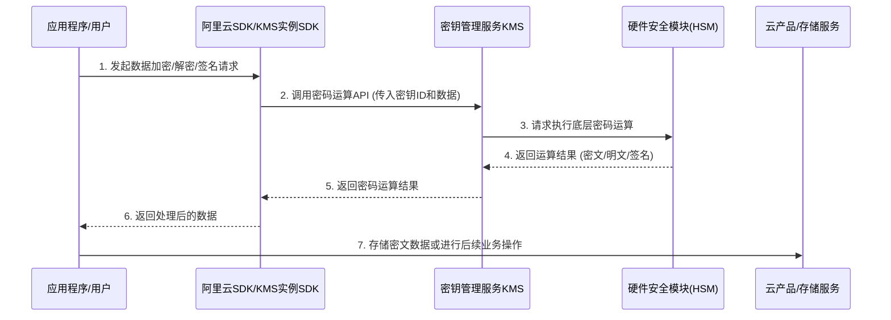
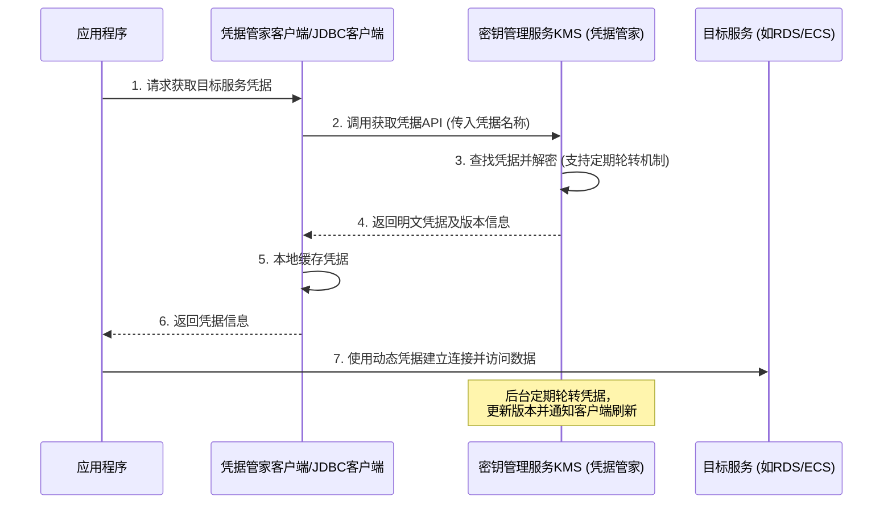

# 业务逻辑时序图

KMS的核心业务逻辑主要围绕**密钥管理**和**凭据管理**两大核心组件展开。以下分别展示数据加解密与凭据动态获取的核心业务时序图。

**密钥管理与数据加解密流程**

应用程序通过集成阿里云SDK或KMS实例SDK，调用KMS提供的密码运算API。KMS底层依托经权威认证的硬件安全模块（HSM）保障密钥的安全托管与运算，完成数据的加密、解密或数字签名后，将结果返回给应用，应用再将密文数据安全存储至各类云产品（如ECS云盘、OSS、RDS等）中。

**凭据管理与动态获取流程**

应用程序通过凭据管家客户端、凭据管家JDBC客户端或RAM凭据插件，向KMS请求托管的凭据（如RDS账密、RAM AK、ECS凭据等）。KMS解密并返回凭据，客户端在本地缓存后供应用使用。同时，KMS后台支持凭据的定期自动轮转，使应用程序规避明文配置风险，有效降低凭据泄露事件的危害。

