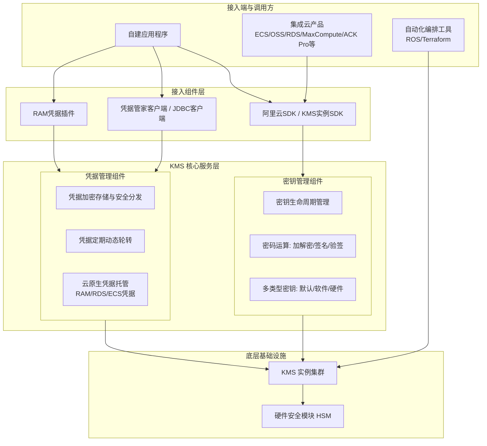

# 完整架构图

**系统[[DDoS/DDoS基础防护/产品对内文档/完整架构图|完整架构图]]**

以下为密钥管理服务（KMS）的完整系统架构图，展示了从用户接入、核心业务组件到底层基础设施的模块划分与调用关系：

**架构模块说明**

*   **接入端与调用方**：包括需要使用密码运算或凭据托管的自建应用程序、需要服务端数据加密保护的阿里云产品（如 ECS、OSS、RDS 等），以及用于实施默认加密策略和自动化运维的编排工具（ROS、Terraform）。
*   **接入组件层**：提供极简的应用接入方式。密钥管理主要通过阿里云 SDK 和 KMS 实例 SDK 接入；凭据管理则通过凭据管家客户端、JDBC 客户端以及 RAM 凭据插件进行安全对接。
*   **KMS 核心服务层**：
    *   **密钥管理组件**：负责密钥的全生命周期管理，提供丰富的密钥类型（默认密钥、软件密钥、硬件密钥），并执行加密、解密、数字签名、验签等核心密码运算。支持云原生加密及容器服务 ACK Pro 的 Secret 落盘加密。
    *   **凭据管理组件**：负责凭据的加密存储、中心化管理和安全分发，支持 RAM、RDS、ECS 等云原生凭据的托管与定期动态轮转，有效降低凭据泄露风险。
*   **底层基础设施**：KMS 实例集群提供高可用的计算与存储支撑，并深度集成经权威认证的硬件安全模块（HSM），以满足高安全等级和密码技术应用的合规要求。

**已知问题和注意事项**

1.  **硬件密钥（HSM）合规性**：在使用硬件密钥以满足高安全等级和合规要求时，需确保所选的 HSM 模块已通过相关的权威安全认证，并了解其特定的性能与配额限制。
2.  **凭据轮转的应用适配**：在配置凭据定期轮转功能时，需确保接入的应用程序（如通过 JDBC 客户端或凭据管家客户端）具备动态获取和刷新凭据的能力，以彻底规避明文配置和硬编码风险。
3.  **自动化加密策略的影响**：使用 Terraform 或 ROS 进行中心化规模化管理并自动化实施默认加密策略时，需提前评估对现有云产品（如 ECS 云盘、OSS Bucket）的兼容性影响，避免对存量未加密数据或业务运行造成意外中断。
4.  **SDK 版本与兼容性**：极简应用接入依赖于各类 SDK 和插件，在升级 KMS 实例或调整密钥/凭据策略时，需同步关注阿里云 SDK、KMS 实例 SDK 及凭据管家客户端的版本更新，确保接口兼容性。