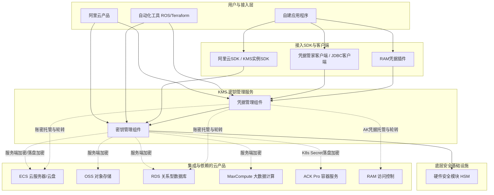

# 服务介绍

**产品定位**
密钥管理服务KMS（Key Management Service）是阿里云提供的一站式密钥管理和数据加密服务平台，同时也是一站式凭据安全管理平台。KMS提供简单、可靠、安全、合规的数据加密保护和凭据管理能力，帮助用户降低在密码基础设施、数据加解密产品和凭据管理产品上的采购、运维、研发开销，使用户能够专注于业务本身。

**演进历程**
KMS从基础的密钥托管服务，逐步演进为涵盖密钥与凭据双重管理的一站式平台。在演进过程中，KMS不断丰富了密钥管理类型（引入软件密钥、硬件密钥），集成了经权威认证的硬件安全模块（HSM）以满足高安全合规要求，并深度适配云原生场景（如支持ACK Pro集群Secret落盘加密），同时引入了Terraform、ROS等自动化编排能力以实现中心化管理。

**涉及的产品与组件**
KMS的核心能力主要依托于**密钥管理**和**凭据管理**两大业务组件，底层依赖**硬件安全模块（HSM）** 提供高安全等级的密码运算支撑，并通过各类**SDK和客户端**（如阿里云SDK、KMS实例SDK、凭据管家客户端等）对外提供极简接入能力。

## 对外介绍架构图

以下为KMS的对外介绍架构图，展示了KMS与各类应用、云产品、自动化工具及底层安全模块的交互关系：

## 各核心组件能力详细说明

KMS主要提供密钥管理和凭据管理两种核心业务组件，具体能力说明如下：

### 密钥管理组件

密钥管理提供密钥安全托管和使用密钥进行密码运算的能力，不仅支持云产品服务端数据加密保护，还支持自建应用程序中的数字签名、加密、解密等密码运算。

| **功能** | **说明** | **参考文档** |
| --- | --- | --- |
| 丰富的密钥管理类型 | 提供免费的默认密钥用于云产品服务端加密，也提供付费的软件密钥、硬件密钥用于自建应用数据加密或云产品服务端加密，满足不同业务和安全合规场景的需求。 | 密钥服务概述 |
| 先进的安全合规能力 | 支持集成经权威认证的硬件安全模块（HSM），满足对密码技术应用的高安全等级和合规要求。 | 硬件密钥 |
| 支持云原生加密 | 支持广泛的云产品集成，除云产品服务端加密外，支持对容器服务ACK Pro集群中的Kubernetes Secret密钥数据进行落盘加密。 | 支持集成KMS加密的云产品 |
| 极简应用接入 | 通过阿里云SDK和KMS实例SDK轻松完成密码运算操作，实现密钥生命周期管理及数据加解密、签名验签等功能。 | 阿里云SDK、KMS实例SDK |
| 中心化规模化管理 | 支持ROS、Terraform等产品，自动化实施默认加密策略，实现在ECS（云盘）、OSS、RDS、MaxCompute等产品默认开启服务端加密。 | Terraform概述 |

### 凭据管理组件

凭据管理提供凭据加密存储、定期轮转、安全分发、中心化管理等能力，使应用程序规避明文配置凭据风险，有效降低凭据泄露事件危害。

| **功能** | **说明** | **参考文档** |
| --- | --- | --- |
| 云原生集成 | 支持托管RAM、RDS、ECS凭据和配置轮转周期以实现凭据动态化，有效应对RAM的AK、RDS和ECS账密泄露的安全威胁。 | 凭据管理概述 |
| 极简应用接入 | 应用可通过凭据管家客户端、RAM凭据插件、凭据管家JDBC客户端，以极简方式接入使用凭据。 | 凭据客户端、凭据JDBC客户端、RAM凭据插件 |
| 中心化规模化管理 | 支持ROS、Terraform等产品，实现凭据的安全托管和运维编排的自动化管理。 | Terraform概述 |

## 与阿里云其他产品的关系

**与Top30云产品的交互方式及影响**
KMS与阿里云多款核心产品深度集成，主要交互方式及影响如下：
*   **ECS（云服务器）**：KMS为ECS云盘提供服务端加密密钥，同时凭据管理组件支持托管ECS账密并配置轮转周期。影响：保障ECS云盘数据落盘安全，防止ECS访问凭据泄露。
*   **OSS（对象存储）**：KMS提供密钥用于OSS服务端加密。影响：保障OSS中存储的敏感数据资产安全。
*   **RDS（关系型数据库）**：KMS提供密钥用于RDS服务端加密，凭据管理组件支持托管RDS账密并实现动态轮转。影响：保障数据库落盘数据安全，规避数据库明文密码配置风险。
*   **MaxCompute（大数据计算）**：KMS提供密钥用于MaxCompute服务端加密。影响：保障大数据计算环境中的数据安全。
*   **ACK Pro（容器服务）**：KMS支持对ACK Pro集群中的Kubernetes Secret密钥数据进行落盘加密。影响：提升云原生容器环境下的Secret数据安全性。
*   **RAM（访问控制）**：凭据管理组件支持托管RAM的AK（AccessKey）凭据并实现动态轮转。影响：有效应对RAM AK泄露的安全威胁。

**产品异常造成的影响与边界**
*   **可能造成的影响**：若KMS服务异常，依赖KMS进行数据加解密的云产品（如开启加密的ECS云盘、RDS、OSS等）可能无法读取或写入加密数据；依赖凭据管家动态获取凭据的应用程序可能无法获取最新轮转的账密或AK，导致连接数据库或调用API失败。
*   **不会造成的影响（边界清晰）**：KMS异常不会影响未开启KMS加密的云产品的基础运行；不会影响已经解密并加载到应用内存中的数据和凭据的使用；不会影响不依赖KMS进行身份认证和访问控制的独立业务逻辑。